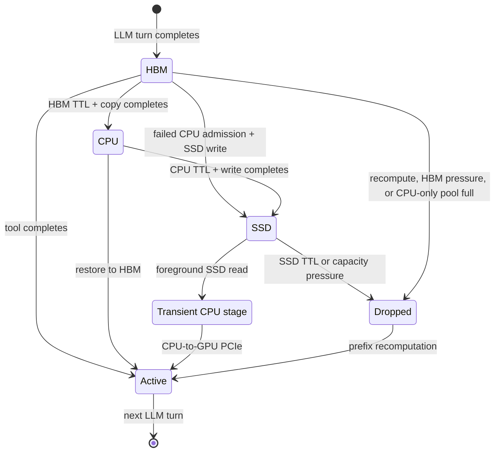

# Agentic idle KV tiering

Tool-calling agents leave a session's KV cache idle while a compiler, test
runner, browser, or another external tool is active. This feature models what
happens to that session-owned KV state during the wait: retain it in HBM,
discard and recompute it, move it to CPU DRAM, or age it through an
HBM → CPU DRAM → SSD hierarchy.

:::warning[Scientific status]

The online tier manager is implemented, and the repository contains legacy
TP4 CSVs labeled H100 for Llama-3.1-70B and Mixtral-8x7B. Their metadata does
not identify the exact H100 SKU or SXM-versus-PCIe form factor, clocks,
CUDA/PyTorch/FlashAttention versions, or measurement command. The Qwen3 1M
methodology therefore uses them only as a **legacy-H100-labeled sensitivity**
through an explicit, kernel-level roofline calibration; it does not rename
them as a current Qwen or absolute DGX-H100 profile. The result remains an
out-of-domain capacity/communication replay rather than a measured Qwen
DCA/MInference result. Its explicit mode is
`dca_dense_full_attention_sensitivity`: the official DCA length envelope is
used with sparse attention disabled and a standard full-attention roofline.
Matched-workload relative cache-policy comparisons under one fixed calibration
band are the primary claim; absolute 1M latency is sensitivity-only.
See
[Calibration boundary and reproduction](#calibration-boundary-and-reproduction)
before using it in a paper. The older Qwen table retained below is a historical
uncalibrated result and is superseded for latency interpretation.

:::

This page defines a reproducible **capacity-pressure** four-way baseline
suite for colocated and layout-compatible same-node P/D serving, a
public-trace workflow, the standalone TP8 analyzer, queue-aware migration, and
SSD endurance accounting. A P8+D8 experiment requires 16 GPUs and therefore
spans two eight-GPU DGX nodes. The bundled online path currently rejects that
cross-node pairing; its P8+D8 results are capacity-replay sensitivities, while
the cycle-level path supports a layout-compatible split such as P4+D4 on one
eight-GPU node. Hold the chosen topology fixed across all four policies.
TTL-driven placement remains a separate sensitivity; it is not mixed into the
capacity-only comparison.

## What is modeled

The tier manager owns only the KV state of a suspended agent session. Active
request KV remains owned by the scheduler. Ownership changes at the end of an
LLM turn and returns to the scheduler when the next dependent turn becomes
eligible.



The policy is online: it never uses the future tool duration to choose a tier.
The simulator knows the tool-completion event only so it can cancel an
unfinished background migration. Migrations commit atomically; until commit,
the upper-tier copy remains usable. This avoids charging partial-copy latency
or losing the only valid copy when a short tool call ends early.

### Same-node P/D semantics

All four capacity-only configs support a layout-compatible same-node P/D
pair. Each session has separate sticky prefill and decode affinities, and its
idle KV is either D-HBM-owned or stored in the node-shared CPU/SSD tier. Before
a call becomes visible to the P scheduler, the router binds its unique
layout-compatible D target and calculates two block-rounded full-prompt
allocations. P subtracts the prefix restored there. D subtracts a retained
prefix only for an HBM-resident return; a CPU/SSD return reserves the complete D
receive buffer because no prefix was staged into D HBM. The request waits in a
per-pair FIFO admission queue while the tier manager obtains the same active-HBM
claims used by ordinary scheduler admission. This FIFO serializes preparation
ownership and the pending P→D handoff for one fixed P/D pair; it is not a
network-service queue, and independent P/D pairs continue independently.
HBM-only immediately discards idle-session KV objects in LRU order. This does
not remove the logical sessions from the router or release their
active-population slots; their next continuations remain dependency-linked and
recompute the missing reusable prefixes. Direct SSD and three-tier policies
instead reserve the future bytes and wait for the selected LRU demotion to
commit atomically. The router then consumes both claims and physically allocates
the missing P and D bytes before P launch. Preallocating the complete P prompt
prevents several restored prefixes from filling P HBM while none has room to
compute its suffix.

After winning the pair FIFO, a continuation may still wait for the relevant P/D
engines to reach a safe preparation boundary. This boundary prevents physical
KV ownership from changing underneath an already dispatched iteration; it is
reported separately and is not transfer time. The CPU/SSD-to-P restore and both
active-HBM reservations can then progress concurrently. Destination P-HBM
capacity for the reusable prefix is reserved before the foreground load starts,
while D independently claims its complete future receive buffer. The paired
active claim is capacity-ready at
`max(prefill_capacity_ready, decode_capacity_ready)`. At the first scheduling
event at or after that timestamp, the router atomically consumes both claims,
physically allocates both roles, records `pd_launch_admission_ready_ns`, and
releases the pair-FIFO owner. This capacity admission does **not** wait for the
restore chain. The request then lives in a separate pending-launch queue until
its own restore-ready timestamp, while a later request may acquire the pair
FIFO and reserve any remaining exact P/D capacity. FIFO therefore covers
preparation and physical admission, not restore-service order; a later request
whose restore finishes first may enter P first. An HBM-resident continuation
still preallocates the missing prompt blocks on both roles. A CPU/SSD
continuation remains invisible to the P scheduler until every restored KV byte
is ready; none of that owner's suffix prefill executes during the load. This is
a request-local pre-admission gate. Swap-out and swap-in do not gate an
unrelated model engine, so already runnable continuous batches continue while
the cold owner waits. Pending admissions and pending launches participate in
LOAD routing, exact idle wakeup, cutoff cleanup, and simulation termination, so
they cannot disappear, be released twice, or oversubscribe either HBM pool.

On an HBM-resident continuation, the decode-owned reusable prefix is copied
D→P and retained on D, P executes only the suffix prefill, and the normal P→D
graph returns only the new suffix. On a CPU/SSD continuation, the node-shared
object is restored directly into P HBM; P→D then transfers the complete prompt
KV into D's full receive reservation. At P completion the D handoff validates
and consumes the existing preallocation; it does not allocate those bytes a
second time. The P→D graph
sends per-rank K+V projection bytes, not the Q portion of fused QKV, and
includes physical KV-head replication. Every SSD restore, including the
direct-SSD baseline, executes two ordered stages: SSD→transient CPU DRAM and
CPU DRAM→P HBM over the per-GPU PCIe links. The transient buffer is not a
persistent CPU cache entry and consumes no durable CPU-cache capacity after
the copy. There is no lower-tier→D-HBM staging or extra D→P peer leg. An
HBM-resident D→P copy uses the configured direct-fabric or CPU-staged peer
model. Thus “direct” means that HBM
pressure writes directly to SSD and that no persistent CPU cache tier exists;
it does not mean that an SSD read bypasses host DRAM.

This path is useful for comparison with systems such as
[DistServe](https://arxiv.org/abs/2401.09670),
[Mooncake](https://www.usenix.org/system/files/fast25-qin.pdf), and vLLM's
[disaggregated-prefill deployment](https://docs.vllm.ai/en/latest/features/disagg_prefill/).

The prefill converter still creates receive-only virtual ranks so communication
callbacks can complete independently of D compute. When one compatible decode
peer is unambiguous, the generated network config aliases each virtual receiver
to the corresponding physical D endpoint: callback matching keeps the logical
rank, while route and delay use the D endpoint. The fast `analytical` backend
does not model overlapping link contention. Use
`--network-backend analytical-congestion-aware` when link contention is part of
the claim. In direct-fabric mode, the frontend also submits each cold
HBM-resident D→P copy to that same ASTRA event queue as an exact-arrival
background transfer, with one D/P endpoint lane per TP rank. ASTRA arbitrates
the shared topology links and physical endpoints against ordinary P→D and
TP/EP communication. Its completion callback releases only the returning
owner; unrelated model graphs can still dispatch, although shared-fabric
contention can lengthen either operation. Strict agentic P/D currently requires
exactly one same-node,
layout-compatible D peer per P instance. An ambiguous peer set or unresolved
receiver alias is rejected at startup instead of being guessed after prefill.

:::caution[Contention boundary]

The shared ASTRA path covers direct HBM-resident D→P traffic, ordinary P→D
traffic, TP/EP communication, topology links, and their physical endpoints. It
is an analytical congestion model, not a packet-level fabric replay. CPU/SSD
restores, asynchronous swap-out, node DRAM, per-rank PCIe copy engines, and SSD
media remain deterministic analytical resource calendars in the Python tier
manager. Those host/storage calendars do not reserve ASTRA collective or link
resources. Do not claim one unified GPU/PCIe/storage fabric scheduler from this
model.

:::

Same-node P and D must match model, TP/PP, block size, weight dtype, and KV
dtype. Cross-node P/D pairs and lower-tier cache-to-P restores are rejected
instead of silently omitting NIC/fabric delay. Adding them requires an explicit NIC path and shared queue resources
calibrated at the same object sizes.

## Public traces

Use a trace with both dependent LLM calls and measured idle intervals. Token
lengths alone cannot expose a migration policy's interaction with short and
long tool calls.

| Source | Useful fields | Recommended use | Important limitation |
| --- | --- | --- | --- |
| [TraceLab coding-agent trace](https://github.com/uw-syfi/TraceLab) ([paper](https://arxiv.org/abs/2606.30560)) | Ordered timing events, session/round identity, and provider token/cache accounting | Primary large-scale cold-session timing trace | Prompts are sanitized, so reusable lineage is a labeled adjacent-round estimate rather than a token-ID-exact LCP |
| [CATraces / CacheWise coding traces](https://github.com/cachewise-project/cachewise-coding-traces) | Real Claude Code sessions with timestamped user, assistant, tool, and context events | Real-world cross-validation of TraceLab's coding-agent result | Human pauses are inferred and public content is redacted, so exact LCP is unavailable |
| [LMCache agentic traces](https://huggingface.co/datasets/sammshen/lmcache-agentic-traces) | Cumulative OpenAI messages and `pre_gap` | Prefix-correctness and target-tokenizer sensitivity | There is no standalone output field; normal continuations recover the preceding assistant message from the next cumulative prompt while generation length remains source-reported |
| [Continuum/CacheTTL](https://arxiv.org/abs/2511.02230) ([preview repository](https://github.com/Hanchenli/vllm-continuum)) | SWE-bench/BFCL tool-call characterization and controlled program arrivals | TTL and tool-return workload sensitivity | No standalone public workload artifact was found, and the workload does not cover human returns |
| [Exgentic/DiscoPosse traces](https://huggingface.co/datasets/DiscoPosse/agent-llm-traces) | OpenTelemetry LLM span start/end timestamps and token usage | Schema diversity and timing sanity checks | Concurrent/overlapping spans can produce zero-clamped adjacent waits; inspect the manifest warning counts |
| `workloads/swe-bench-qwen3-30b-a3b-50-sps0.2.jsonl` | Prebuilt session chains, token IDs, short tool waits | Fast integration smoke test | It is small and its token-ID arrays do not cover every declared token; with a 30 s CPU TTL, none of its positive waits reaches SSD |

TraceLab is the primary cold-session panel because it preserves field timing
across roughly 4,300 sessions, 350,000 LLM steps, 430,000 tool calls, 43
developers, and eight months; its long, heavy-tailed human/tool gaps are the
variable a cold-tier policy acts on. The LMCache data card describes a curated
roughly 787-session, 24,880-iteration set selected for multi-turn prefix growth
and long contexts. Its cumulative messages make exact target-tokenizer LCP
possible, but that selection and its much shorter, unlabeled `pre_gap`
distribution make it a correctness and sensitivity panel rather than the
primary timing population. Its published session totals disagree across the
card, viewer, and source table, so pin and hash the exact snapshot. Do not pool
the two datasets into one headline statistic.

CATraces is the strongest independent field-trace cross-check: its public
Claude Code corpus has 94 session manifests, 81 of them nonempty, and 20,634
LLM calls. Tool events are explicit, but the published human-pause analysis
uses a no-intervening-tool and 2-second-to-24-hour heuristic. Use it as a
separate external-validity panel, not by concatenating rows with TraceLab.

As of July 2026, the official
[Weka NIXL results](https://www.weka.io/article/weka-accelerates-ai-inference-with-nvidia-dynamo-and-nvidia-nixl)
and public repositories do not provide a dormant-session workload trace. The
published artifact is a storage/backend integration and a fixed-size
microbenchmark, so Weka is a calibration target rather than a workload source.
If Weka is evaluated, reuse TraceLab/CATraces as the workload and calibrate a
separate GDS/direct-GPU service curve. Weka's
[GDS material](https://www.weka.io/article/open-sourcing-gds-integration-from-augmented-memory-grid-see-results-for-yourself)
adds fixed-context TTFT and ShareGPT/synthetic benchmark tooling, not a
human/tool dormant-session trace. The deprecated in-process
[LMCache Weka backend](https://docs.lmcache.ai/kv_cache/storage_backends/weka.html)
documents that direct path; LMCache's current
[multiprocess storage tier](https://docs.lmcache.ai/mp/l2_storage/index.html)
documents asynchronous store/prefetch and tier-local LRU but supplies no
trace.

TraceLab and LMCache identify their data as CC BY 4.0; Exgentic identifies its
data as CDLA 2.0. Verify the linked release/data card when pinning a revision.
Record the exact revision, source hash, converter version, tokenizer
provenance, and generated-workload hash in every experiment artifact.

### Convert TraceLab

The v0.0.1 release used for the results below has SHA-256
`9d265eae69a31cae203848bea936f018148eed7ca8bf56050c5abe96da0b4e6b`.
Keep the large raw and converted files outside Git history.

```bash
mkdir -p data/agent-traces workloads/generated
curl -L \
  'https://github.com/uw-syfi/TraceLab/releases/download/v0.0.1/syfi_coding_trace.jsonl.gz' \
  -o data/agent-traces/syfi_coding_trace.jsonl.gz
printf '%s  %s\n' \
  '9d265eae69a31cae203848bea936f018148eed7ca8bf56050c5abe96da0b4e6b' \
  'data/agent-traces/syfi_coding_trace.jsonl.gz' | sha256sum --check -

python -m workloads.generators agent-traces \
  --format tracelab \
  --source data/agent-traces/syfi_coding_trace.jsonl.gz \
  --source-revision v0.0.1 \
  --output workloads/generated/tracelab-agentic-sps0.2.jsonl \
  --sps 0.2 --seed 42 --tool-wait-mode union
```

The generated sidecar records the raw source SHA-256 and size, converter
source SHA-256 and Git state, every conversion argument, validation warnings,
and the output SHA-256. Keep it next to the JSONL so experiment drivers can
embed the conversion contract rather than recording only the derived file.

The converter disk-spools by TraceLab's composite source identity and orders
ties by ingestion sequence, so a repeated raw `session_id` cannot merge two
projects. For each adjacent pair it measures the interval from the previous
round's last model-output event to the next round's latest triggering input
event. This preserves human pauses and excludes tool execution that overlaps
response streaming. `--tool-wait-mode` controls only the explicitly labeled
fallback when those event boundaries are absent.

By default, `--tracelab-reuse-mode eligible` uses TraceLab's ideal-cache
adjacent-round estimator. The incumbent provider's observed `prefix_tokens`
is retained separately as `observed_provider_hit_toks`; it is not fed back
as the proposed policy's opportunity. Use `--tracelab-reuse-mode observed`
only as a lower-bound sensitivity.

The converter also preserves the source-derived append count as
`raw_newly_append_toks` before normalizing the legacy `newly_append_toks`
field to at least one. Runtime accounting derives fresh tokens from
`input_toks - effective_reuse_toks`; the canonical pre-admission mode does not
execute any of them until the restore is complete.

:::danger[Regenerate pre-v3 workloads]

Converter schema v1 omitted human idle gaps and treated provider cache outcomes
as reusable opportunity. Schema v2 did not recognize generic `context_reset`
events and used the older observed-field name. Regenerate headline workloads
with schema v3 and record the source checksum, converter commit, manifest, and
output checksum.

:::

### Convert LMCache or Exgentic

Remote Hugging Face sources are streamed. Supplying `--tokenizer` makes the
converter retokenize sources that include full messages and records exact
longest-common-prefix reuse where possible. The command below pins LMCache to
dataset revision `6e043b9e89865df3aec19fd5679286b683bfd70e` and Qwen3-32B
tokenizer revision `f47c17a3e9a15aacd6eb42c0c96f75b9de238af8` rather than
relying on moving default branches.

```bash
python -m workloads.generators agent-traces \
  --format lmcache \
  --source sammshen/lmcache-agentic-traces \
  --source-revision 6e043b9e89865df3aec19fd5679286b683bfd70e \
  --output workloads/generated/lmcache-qwen3-sps0.2.jsonl \
  --tokenizer Qwen/Qwen3-32B \
  --tokenizer-revision f47c17a3e9a15aacd6eb42c0c96f75b9de238af8 \
  --sps 0.2 --seed 42

python -m workloads.generators agent-traces \
  --format exgentic \
  --source DiscoPosse/agent-llm-traces \
  --output workloads/generated/exgentic-sps0.2.jsonl \
  --sps 0.2 --seed 42
```

Prefix reuse has explicit provenance on each turn:

- `exact`: causal token-ID prefix under the target tokenizer. For LMCache, a
  normal transition includes the recovered preceding assistant output.
- `reported`: incumbent provider prompt-cache accounting, retained only for
  the TraceLab observed-cache sensitivity.
- `estimated`: a policy-independent lineage or length estimate. This is the
  default for sanitized TraceLab.

Do not pool these classes without a sensitivity analysis. TraceLab has no
sanitized prompt text, so changing the simulated model does not retokenize its
prompt counts.

### LCP and whether traces should be combined

**LCP** means the longest common prefix of two token-ID sequences. For a
completed turn with token sequence `A` and the next prompt `B`, only
`A[:LCP(A, B)]` is a valid causal KV prefix. A matching suffix or a set of
matching blocks after the first divergence cannot be reused as ordinary dense
attention KV because token positions and all later hidden states have changed.

TraceLab's reported `prefix_tokens` measures what the incumbent provider cache
served. Using it as `prefix_reuse_toks` would make a long-idle provider miss
unrecoverable even for the policy being evaluated. The default converter
therefore estimates `fresh` and `cacheable` from adjacent context growth and
the preceding output, resets lineage on round gaps or compaction, and labels
the result `estimated`. The sanitized release still cannot support exact
block identity or cross-session deduplication.

LMCache contains cumulative messages. With `--tokenizer`, the converter
recovers the previous assistant message from the next prompt, tokenizes that
completed context without a new generation marker, and clamps the exact reuse
to the tokens the previous request actually computed. If the assistant output
is not replayed, it falls back to the exact input-only LCP and records that
lineage scope.

This difference does **not** require concatenating the two raw traces. The
paper-grade design is:

1. Use TraceLab as the primary timing and population panel with policy-independent
   eligible reuse; report observed-provider reuse as a sensitivity.
2. Use LMCache as a separate completed-context exact-prefix and tokenizer-sensitivity panel.
3. Report each panel's selected-transition count, context filtering, and reuse
   provenance independently.

If one synthetic hybrid is useful for a controlled sensitivity, sample LMCache
LCP ratios conditionally on TraceLab turn index, prompt length, appended
tokens, and tool-wait bucket. Label that workload **synthetic** and preserve the
original two panels. Row concatenation or independently sampling an LCP ratio
would destroy correlations and is not a defensible primary result.

## Baselines suitable for a paper

The headline experiment has four capacity-pressure baselines
below. They mirror the design space explored by systems such as
[InferCept](https://arxiv.org/abs/2402.01869),
[Pensieve](https://arxiv.org/abs/2312.05516), and
[CachedAttention/AttentionStore](https://www.usenix.org/conference/atc24/presentation/gao-bin-cost),
while keeping the policy deliberately simple and reproducible.

| Baseline | Config | Behavior | What it isolates |
| --- | --- | --- | --- |
| 1. HBM only + recomputation | `configs/agentic_kv/hbm_lru_recompute.json` | Retain idle KV in HBM; under pressure, discard whole idle-session KV objects in LRU order while the logical sessions remain admitted, then recompute each missing reusable prefix on resume | Cost of capacity misses without a lower tier |
| 2. HBM + SSD direct demotion | `configs/agentic_kv/hbm_ssd_direct_8ssd.json` | Under HBM pressure, atomically demote the LRU whole session directly to SSD; restore SSD→transient CPU DRAM→P HBM, then use the normal P→D handoff; SSD-capacity LRU ends in recomputation | SSD-backed persistence without a persistent CPU cache tier; “direct” does not mean that restore bypasses host DRAM |
| 3. HBM + CPU + SSD | `configs/agentic_kv/tiered_capacity_fullwrite_8ssd.json` | Under pressure, demote HBM LRU → CPU and CPU LRU → SSD; restore through CPU staging; terminal SSD LRU misses recompute | Benefit and overhead of a conventional three-tier hierarchy |
| 4. HBM + CPU + SSD, partial-prefix recompute | `configs/agentic_kv/qwen3_1m_p4d4/tiered_queue_recompute.json` | Keep baseline 3's placement and asynchronous demotion. Before any destination reservation or foreground I/O, activate a full/partial/zero restore search only when the full CPU/SSD restore's immutable wait exceeds 4× service. Compare block-aligned prefix restore plus calibrated suffix recomputation, with a 1.25× recompute penalty | A causal severe-queue fallback which can reduce transfer bytes without discarding the whole reusable prefix |

All four set `demotion_mode=capacity-only`, so elapsed tool time alone never
moves or drops an object. They also set `active_preemption_mode=recompute`:
idle session KV is reclaimed before active KV, and only residual active
pressure uses the same recomputation fallback in every row. Baselines 2–4
use the same eight-drive capacity, 50 GB/s effective CPU↔GPU PCIe bandwidth
per GPU, 400 GB/s node-shared CPU DRAM bandwidth, and 55.2/33.6 GB/s aggregate
SSD read/write inputs. NVIDIA specifies an
[eight-drive 3.84-TB U.2 RAID 0 cache](https://docs.nvidia.com/dgx/dgxh100-user-guide/introduction-to-dgxh100.html),
and its
[firmware-guide example](https://docs.nvidia.com/dgx/dgxh100-fw-update-guide/nvme-fw-update.html)
enumerates eight `KCM6DRUL3T84` devices. KIOXIA rates that 3.84-TB CM6-R at
up to 6.9/4.2 GB/s sequential read/write over PCIe 4.0 x4
([product brief](https://americas.kioxia.com/content/dam/kioxia/shared/business/ssd/enterprise-ssd/asset/productbrief/eSSD-CM6-R-product-brief.pdf)).
Assuming an all-CM6 pool, the configured 55.2/33.6 GB/s values are inferred
eight-drive manufacturer sums, not measured end-to-end RAID 0 throughput;
replace them with fio results from the evaluated host. Both baselines charge
full-object SSD writes.
Changing only `policy` on one JSON file is not a valid sweep because it would
silently retain the wrong path and write-mode assumptions. Declare the
cluster's node-shared CPU-memory capacity and bandwidth separately. The Qwen3
1M P4+D4 online suite uses its dedicated policy configs under
`configs/agentic_kv/qwen3_1m_p4d4/`: exactly 512 GB SI
(`cpu_mem.mem_size=476.837158203125`, because cluster capacity is in binary
GiB) and 200 GB/s. The older generic configs' 400-GB/s DRAM value remains a
separate sensitivity and must not be mixed into that suite.

Baseline 4 is deliberately online and myopic. Before mutating live state, a
purpose-built shadow applies the ordinary HBM LRU reservation path to cloned
entries, memory counters, and transfer calendars. The projection therefore
includes destination-HBM admission, HBM LRU→CPU demotions, any CPU LRU→SSD
cascade or SSD bypass, and the resulting foreground restore queue. For a CPU
hit the foreground stage is `cpu_to_hbm`; for an SSD hit it is
`ssd_to_cpu_stage → cpu_stage_to_hbm`. The severe gate and candidate cost are

```text
total_wait = hbm_admission_wait + foreground_transfer_queue_wait
severe = total_wait > max(4.0 × restore_service, 0 ms)
if not severe:
    H = R
else:
    cost(H) = projected_prefix_restore(H)
              + 1.25 × [singleton_COMP(hit=H) - singleton_COMP(hit=R)]
    H = argmin cost(H) over {R, 0, feasible block-aligned prefixes}
```

Here `R` is the reusable token prefix and `H` is the contiguous prefix actually
restored. `H=R` is the ordinary tiered restore, `H=0` is full recomputation,
and every interior `H` is block aligned. Candidate generation includes the
largest prefix which fits the current unreserved-capacity snapshot and
deterministic geometric interior points; this lets a shorter gang transfer use
an earlier calendar hole. Ties prefer the larger `H`, and a modified choice
must strictly improve the predicted path over `H=R`, so equality restores.

The COMP term is the singleton chunked-prefill difference for exactly the
dropped suffix `[H,R)`, evaluated by the same online H100 provider and runtime
chunk limit as the trace. It uses no future batch state. The estimate excludes
collectives, compute queueing, and batching externalities, so the 1.25
multiplier is a conservative penalty rather than a claim of exact
counterfactual elapsed time.

An interior candidate must also fit a causal, non-mutating P/D HBM snapshot
through the configured next-prefill-chunk horizon. For P, the check is the
restored `H` blocks plus growth through that chunk. For the fixed D peer, a
CPU/SSD restore retains no D prefix, so the check covers all blocks through
`H + chunk`. `queue_recompute_prefill_headroom_chunks=1.0` selects one runtime
chunk horizon. These bytes are **not reserved by the policy**. The ordinary
atomic P/D chunk-admission path remains the capacity owner after DMA, so other
work can consume the observed slack and create later admission wait. Reports
therefore label the values a timestamped `capacity_headroom_snapshot`, never
an immediate-admission guarantee.

If the object still cannot fit after the shadow's eligible LRU cascade, the
selector fails closed to the ordinary full-restore path rather than
manufacturing an infinite wait. Otherwise the first nonzero decision and its
`H` are frozen across capacity retries. The live path reserves and transfers
only `H` bytes and asserts that its ready time, victims, and calendars equal
the selected prefix shadow. `[H,R)` enters ordinary prefill and P→D new-token
accounting; non-prefix block subsets are never retained. The complete CPU/SSD
source remains authoritative and capacity-pinned until the prefix DMA
completes, then the whole source and any stale durable SSD duplicate are
released exactly. `H=0` installs no foreground I/O and releases the source
through the recomputation cleanup path. Every choice retains the logical
session and admission slot. HBM hits and zero-reuse returns are never
evaluated.

Reports expose `R`, `H`, dropped-suffix tokens and bytes, full and selected
prefix projections, P/D headroom snapshots, candidate set, selection reason,
source tier and pin scope, per-source full/partial/zero decision counts,
provider provenance, and exact suffix COMP under `queue_recompute_policy`.
Schema-level invariants require block alignment, byte/token conservation,
severe-gate causality, and zero logical-session drops.

The estimate is a causal policy guard, not an elapsed-time oracle: it compares
projected prefix restore plus singleton suffix COMP from the same online H100
provider, but it cannot know future continuous-batch composition, collective
contention, later P/D admission, or compute-queue externalities. Keep the
multiplier, wait/service ratio, and headroom horizon fixed after a disjoint
discovery run and report their sensitivity separately. The checked-in
`tiered_partial_recompute_r8_g1_25.json` and
`tiered_partial_recompute_r12_g1_5.json` files are conservative trigger/cost
candidates for that discovery phase, not extra headline baselines.

All four headline configs set `swap_execution_mode=async-pre-admission`.
Swap-out is asynchronous background work: it never installs a model-engine or
global barrier, although it still consumes the modeled copy, DRAM, and storage
resources. Swap-in is also asynchronous with respect to other requests, but
destination HBM is reserved before the load and the returning owner does not
enter a compute batch until its entire reusable KV prefix is available. There
is no same-owner suffix-prefill overlap. Other admitted requests and
continuous batches remain runnable while that owner waits. The older
`async-decode-join` mode is retained only as an optimistic layerwise-streaming
sensitivity, and `sync-engine-barrier` is retained only as an adverse
global-blocking sensitivity. Neither is a headline baseline.

The TTL configs (`recompute.json`, `cpu_swap.json`,
`tiered_writeback_8ssd.json`, and `tiered_fullwrite_8ssd.json`) answer a
different question: when should an online age policy proactively move cold
state? Report them as sensitivity or proposed-policy rows, not as substitutes
for the four capacity baselines.

`off` disables idle-KV ownership and metrics and uses the ordinary request-KV
lifecycle. It is not equivalent to the explicit recompute baseline: only the
latter records idle-KV misses and recomputed-prefix tokens. Session placement
remains sticky in both modes for a controlled comparison.

For a TTL sensitivity, the 50 ms, 30 s, and 1 h thresholds are reproducible
defaults, not universally optimal constants. Select them on a training subset
and report the unchanged policy on a disjoint test subset. Do not tune on the
evaluation trace.

### Context admissibility is not KV paging

The model context limit covers the prompt and requested output together, as
does vLLM's
[`max_model_len`](https://docs.vllm.ai/en/stable/api/vllm/config/model/).
The online scheduler therefore rejects a request when
`input_toks + output_toks` exceeds the selected model's
`max_position_embeddings`. Increasing `block_size`, adding more KV blocks, or
offloading those blocks cannot make such a request semantically executable.
Blocked KV allocation addresses physical capacity and fragmentation; it does
not extend positional encoding, trained context range, or the attention
kernel's supported sequence length.

The capacity replay applies the same total-sequence test when
`--max-context-tokens` is set. It retains an infeasible call in the literal
all-call denominator but assigns no target-model service time and breaks its
cache lineage. Such a censored replay is valid for an explicitly labeled
placement sensitivity only. Its TTFT, throughput, makespan, and subsequent
closed-loop pressure are not headline measurements because the skipped call
completes unrealistically quickly.

This distinction matters for the converted TraceLab file used below. Of
357,161 calls, 168,520 (47.1832%) request more than Llama-3.1's 131,072-token
window after prompt and output are combined. Native 262,144-token Qwen3 still
excludes 34,954 calls (9.7866%). The observed maximum is 1,006,146 tokens, so
the full population fits the official Qwen3-30B-A3B-Instruct-2507
[1,010,000-token recipe](https://huggingface.co/Qwen/Qwen3-30B-A3B-Instruct-2507).
The checked-in P4+D4 experiment uses only its declared length envelope. The
pinned official
[`config_1m.json`](https://huggingface.co/Qwen/Qwen3-30B-A3B-Instruct-2507/blob/fcc1528445189b27dbe3139c2cf9a1139203a4ff/config_1m.json)
enables sparse attention, while this experiment explicitly sets
`sparse_attention_enabled: false` and extrapolates standard full-attention
roofline latency. The simulator rejects a value above the native 262,144-token
window without this explicit contract, and always rejects a value above
1,010,000. That bound does not turn standard FlashAttention measurements into
DCA/MInference measurements. An absolute online TTFT, TPOT, decode, or
throughput claim still requires serving-matched TP4 measurements on the target
H100 software stack. Do not raise another model's config limit or report this
extrapolation as a measured online result. Alternatively, implement compaction
as an explicit policy and terminate KV lineage at every compaction or context
reset.

### Capacity pressure

Capacity behavior is deterministic. Every candidate order is
`(last_access_ns, session_id)`, so ties do not depend on dictionary or process
order.

- **HBM:** idle whole-session objects are lower priority than runnable active
  work. A new idle admission, restore, or active allocation reclaims HBM LRU
  entries first. HBM-only discards the selected KV objects immediately, without
  removing their logical sessions or freeing their active-session slots; direct
  and three-tier policies keep the HBM source authoritative until the demotion
  commits. A logical claim reserves the future bytes so concurrent admissions
  cannot consume them while the copy is in flight.
- **CPU DRAM:** capacity is one shared budget per node, not one duplicated
  budget per instance. The three-tier policy demotes CPU LRU records to SSD.
  An object that cannot fit CPU even after all eligible victims are removed
  bypasses directly to the host-staged SSD path.
- **SSD:** evict durable SSD records in LRU order until the new record fits. If
  the object still cannot be admitted, its next resume recomputes.

Source ownership, pending destination capacity, and future HBM allocation are
all reserved atomically. A short tool gap may cancel a background copy; its
partial queue occupancy and SSD host writes remain charged, while the valid
source survives. Capacity drops and TTL drops are separate counters. These
rules form a clean baseline, not an optimal admission controller: a future
value-based policy should compare predicted reuse benefit against migration
cost and must be evaluated separately.

Agentic-KV schema 15 retains `events[].event="drop"` for compatibility, but
each record is explicitly scoped and classified. `object_scope` is
`kv_cache_entry`, and `logical_session_effect` is `none`: releasing a KV object
never removes its logical session or frees its active-session slot.

| `drop_class` | `reason` values | Interpretation |
| --- | --- | --- |
| `capacity_loss` | `hbm_capacity`, `cpu_capacity`, `ssd_capacity` | Reusable KV discarded because a tier was full |
| `ttl_loss` | `ssd_ttl` | Reusable KV discarded by an age/TTL sensitivity |
| `resume_recompute_cleanup` | `resume_miss` | Obsolete KV released after recomputation fallback |
| `policy_loss` | `queue_pressure` | Explicit queue-aware policy chose recomputation for a reusable lower-tier object |
| `normal_session_cleanup` | `session_end` | Normal KV cleanup after final session completion |
| `measurement_cleanup` | `measurement_censor` | KV cleanup for an explicitly right-censored session |

The report repeats this contract under `event_semantics.drop`, including the
class descriptions. Do not count raw `drop` events as dropped sessions or as
capacity misses because that mixes loss with normal and measurement cleanup.
In backlog mode, templates beyond `K` wait in FIFO admission order until a
slot is released by final-request completion on the decode owner (or the
colocated owner without P/D). A final `output_toks=1` request completes after
the P→D ownership handoff without launching a D-side model graph. An explicitly
configured measurement cutoff right-censors the unfinished population instead
of counting it as a logical drop.

### Prefix caching without double counting

An agent continuation normally reuses only a prefix of the previous turn.
Reuse comes from exact token IDs when available, otherwise from the trace's
explicit `prefix_reuse_toks`; an estimated fallback is labeled as such. The
logical hit remains the exact reusable token count `h`, while physical restore
traffic and HBM allocation cover `ceil(h / block_size) × block_size` tokens.
The extra tail is storage granularity, not a logical cache hit.

Even when a trace declares the entire next prompt reusable, the simulator caps
the hit at `input_toks - 1`. It executes at least one prompt token because the
KV cache does not contain that final prompt token's hidden state/logits. The
hit/recompute metrics therefore report exact logical tokens rather than
rounded physical pages. The final generated token of the previous turn is
also absent from its completed KV state. Durable-lineage validity uses the raw
declared longest-common-prefix count before this `input_toks - 1` execution
cap, so forcing one prompt token through the model does not invalidate an
otherwise identical durable prefix.

Incremental SSD writes require a transitive whole-object lineage, not merely a
nondecreasing context length or an immediately matching pair of turns. Every
intervening turn must report reuse of the complete durable object, including a
turn that never reaches SSD itself. A partial or divergent turn, or a skipped
or filtered transition whose lineage cannot be verified, invalidates the
append base. The next SSD demotion therefore rewrites the complete object; it
does not truncate the old object and salvage a suffix. Valid appends are
charged at token granularity even when growth remains inside an allocated
block. This is a conservative whole-object baseline without block-level
copy-on-write sharing; full rewrite remains the upper-bound sensitivity.
The keep-on-read durable record has its own SSD TTL even while a newer session
copy is active or resides in HBM/CPU. An in-flight SSD read pins that record
through DMA completion; an expiry that ties a later demotion wins and forces a
full rewrite.

Generic prefix caching and suspended-session caching answer different
questions:

| Cache | Lookup identity | Lifetime and policy | Typical reuse |
| --- | --- | --- | --- |
| Generic radix prefix cache | Token/block content shared by any compatible request | Popularity/LRU under scheduler ownership | A system prompt or shared code prefix across unrelated requests |
| Agentic session cache | A lease on one session's completed-turn KV while its tool is running | Tool-gap, TTL, capacity, and expected continuation under the tier manager | Private conversation history reused by the next turn in that session |

The logical categories overlap: the same physical blocks may simultaneously
be reachable from a radix node and leased by a suspended session. The current
simulator deliberately rejects enabling both allocators because treating those
references as two copies would double-count HBM, migration traffic, and hit
tokens. Run three controlled baselines today:

1. **Session tiering:** pass `--no-enable-prefix-caching` and an agentic-KV
   policy.
2. **Generic prefix cache:** omit agentic tiering and use the existing
   [prefix-caching baseline](./prefix-caching).
3. **No reuse:** disable both for a full-prefill control.

Supporting both correctly requires a shared physical block layer rather than
removing that guard. A suitable design has:

1. One `KVBlockDirectory` keyed by model, tokenizer/adapter, KV dtype, TP
   layout, block position, and content hash.
2. One location/version record per physical block, with independent `active`,
   `radix`, and `session_lease` reference counts.
3. Radix nodes and session records storing block IDs rather than allocating
   their own byte ranges.
4. Resume lookup computing the longest *contiguous* reusable block prefix and
   taking the union of references. Prefix and session hit lengths must never be
   added.
5. Per-block P/D ownership and D→P/P→D transfers; demotion or deletion is
   legal only when all references permit it.
6. Metrics attributed to unique physical bytes, with separate logical hit
   provenance.

This is consistent with
[SGLang RadixAttention](https://papers.nips.cc/paper_files/paper/2024/file/724be4472168f31ba1c9ac630f15dec8-Paper-Conference.pdf),
but extends its ownership model across tiers and P/D roles. Until that shared
directory exists, separate panels are the conservative and reproducible
baseline.

## Runtime model

For BF16/FP16 KV, the logical bytes per token are

```text
B_logical/token = 2 × layers × num_kv_heads × head_dim × 2 bytes
```

Tensor parallelism can replicate GQA KV heads. The physical TP layout used by
the runtime and the analyzer is

```text
kv_heads/rank = max(1, ceil(num_kv_heads / TP))
B_cluster/token = 2 × layers × kv_heads/rank × head_dim × bytes × TP
```

Thus TP8 doubles the physical KV bytes of Qwen3-30B-A3B, which has four KV
heads. `--kv-cache-dtype fp8` changes the element width to one byte. Physical
restore allocation rounds **up** to `--block-size`; hit and recompute counters
retain the exact logical token count, and a full-prefix hit still executes one
prompt token.

CPU migration latency is modeled as simultaneous rank-local PCIe traffic
sharing aggregate host DRAM:

```text
T_cpu = fixed + max(B_rank / BW_PCIe, B_cluster / BW_DRAM)
```

Every SSD restore, including the direct baseline, uses two serial stages:

```text
T_ssd_to_cpu = fixed_ssd
                 + max(B_cluster / BW_SSD_aggregate,
                       B_cluster / BW_DRAM)
T_cpu_to_gpu = fixed_cpu
                 + max(B_rank / BW_PCIe,
                       B_cluster / BW_DRAM)
T_ssd_restore = T_ssd_to_cpu + T_cpu_to_gpu
```

The direct baseline has no persistent CPU-cache admission or occupancy. Its
background HBM→SSD write remains a direct analytical path:

```text
T_hbm_to_ssd_direct = fixed_ssd
                        + max(B_rank / BW_PCIe,
                              B_cluster / BW_SSD_aggregate)
```

The direct-write curve is a first-order model, **not** a measured claim about
GPUDirect Storage, filesystem, NVMe driver, or DMA setup performance. The read
curve deliberately does not assume GDS. Calibrate both service curves at the
evaluated KV object sizes and queue depths before using absolute latency
claims.

The Python tier manager incorporates CPU, DRAM, PCIe, and SSD contention
directly in simulated time. These host/storage transfers use deterministic
**gang FCFS** without foreground-priority preemption: transfer `j` starts at

```text
start_j = max(arrival_j, busy_until_r for every required resource r)
finish_j = start_j + isolated_service_j
```

The SSD→CPU stage reserves the SSD-pool read resource and the node-shared
half-duplex DRAM resource. The following CPU→GPU stage reserves that DRAM
resource plus one PCIe/copy engine per TP rank. A direct HBM→SSD background
write reserves the source PCIe/copy engines and SSD-pool write resource but
does not create a persistent CPU object. A CPU/SSD hit restores directly to
the selected P HBM and does not reserve D PCIe, D HBM, or a cold-peer resource.
Only an HBM-resident continuation uses a same-node D→P copy. In direct-fabric
mode, that copy bypasses the Python gang-FCFS calendar and is submitted to the
shared congestion-aware ASTRA topology. It may co-execute with an unrelated
ASTRA model batch, while link or endpoint contention can lengthen both; its
completion callback gates only the returning owner. A CPU/SSD restore changes the dependent
request's eligibility timestamp, so queueing changes batching and downstream
latency; it is not added after the simulation.

In the headline `async-pre-admission` mode, the incoming request-ready event is
the earliest legal restore issue epoch. For TraceLab, that is the tool-result
boundary for a tool return and the actual user-message boundary for a human
return; restore is not backdated into an elapsed wait. Mixed returns use their
latest required input event. Per-pair FIFO or prepare-boundary admission may
delay the physical issue and is reported separately. Target HBM is reserved
before the first foreground transfer stage. The
owner remains outside the scheduler until the complete CPU/SSD→HBM chain is
ready, so all restore time contributes to that call's resume eligibility and
TTFT path. This request-local gate does not stop an already admitted HBM batch
or prevent unrelated ready work from forming later continuous batches.

HBM- and lower-tier-origin calls may share a prefill batch only after the
lower-tier call's restore has completed and it has been admitted. The restore
does not hold the currently executing batch or delay its HBM members. Once
admitted, the restored owner can still affect peers through ordinary batch
token budgets, attention-shape effects, and modeled shared-resource
contention. Online metrics schema 12 records `agentic_batch_schedule` and
`agentic_batch_complete`, source × return-class membership, destination-HBM
reservation and restore-ready timestamps, and the zero same-owner compute
overlap. `restore_barrier_inside_batch=false` remains literal: no DMA node is
inserted into an already formed batch.

The optional `async-decode-join` mode is a coarse optimistic bound. Executing
a suffix while a whole-object prefix restore is incomplete requires layerwise
KV streaming and appropriate attention dependencies in a real system.
`sync-engine-barrier` remains an adverse sensitivity: it drains affected
current iterations and gates their next dispatch through commit, including
unrelated runnable work. Neither sensitivity is the headline policy or a
claim that InferCept's CUDA event stream was replayed.

Background demotions retain their authoritative upper-tier source until
commit. If queue wait plus service cannot finish before the known continuation
release, the copy is cancelled at that release; consumed service and wasted
bytes are still recorded. This is a deliberately simple baseline, not a claim
that a production storage stack is a single FCFS server. A final paper should
calibrate service curves at the trace's object-size and queue-depth
distribution and sweep PCIe/NUMA/SSD queue topology. The standalone analyzer
still has no global execution timeline or cross-session queue and is therefore
an isolated-transfer analytical sensitivity, not the contended result.

The host/storage queue contends agentic CPU/SSD migrations with other agentic
CPU/SSD migrations. It does not share reservations with ASTRA-Sim,
non-agentic KV eviction/reload, NIC traffic, or GPU kernels using the same copy
engines. Conversely, direct HBM D→P restores do share ASTRA's links and physical
endpoint arbiters with ordinary online P→D and TP/EP communication. Treat the
Python host/storage calendar and congestion-aware ASTRA as complementary
first-order contention models, not one unified resource scheduler; a fully
shared model is required before claiming deployment-level tail latency.

### Reading overhead without ambiguous denominators

The metrics JSON separates service, queue wait, and two kinds of denominator:

| Field | Meaning |
| --- | --- |
| `time_breakdown.aggregate_request_migration_raw_elapsed_ns` | Request-summed physical restore interval after pair and prepare-boundary admission |
| `time_breakdown.aggregate_request_migration_stall_ns` | Physical restore charged to the owner; equals `aggregate_request_migration_raw_elapsed_ns` in canonical `async-pre-admission` |
| `time_breakdown.aggregate_pd_pair_fifo_wait_ns` | Admission wait behind an earlier preparation/handoff on the same fixed P/D pair; not migration time |
| `time_breakdown.aggregate_prepare_boundary_wait_ns` | Wait for the relevant engine boundary before physical restore may issue; not migration time |
| `time_breakdown.aggregate_owner_ready_gate_ns` | Pair FIFO + prepare-boundary + physical restore, summed once per prepared continuation; a preparation later censored by early stop remains in this full-simulation numerator |
| `time_breakdown.aggregate_request_migration_hbm_admission_wait_ns` | Wait for an atomic LRU demotion to make destination HBM capacity available |
| `time_breakdown.aggregate_request_migration_queue_wait_ns` | Wait after admission for all required transfer resources |
| `time_breakdown.aggregate_request_migration_service_ns` | Isolated transfer service on the critical path |
| `time_breakdown.aggregate_transient_dram_capacity_wait_ns` | SSD-bounce-buffer pressure diagnostic; already reflected in the causal preparation/restore timeline and must not be added to the owner gate |
| `asynchronous_restore.aggregate_swap_in_gross_ns` | Gross interval for the optional `async-decode-join` sensitivity; zero for canonical pre-admission accounting |
| `asynchronous_restore.aggregate_prefill_execution_overlap_ns` | Same-owner overlap in the optional decode-join sensitivity; zero in `async-pre-admission` |
| `asynchronous_restore.aggregate_owner_decode_barrier_ns` | Optional final-prompt/decode join wait; canonical delay is reported in `time_breakdown` instead |
| `asynchronous_restore.aggregate_other_hidden_ns` | Residual interval for the optional decode-join decomposition |
| `asynchronous_restore.by_source_and_return_gap_type` | Optional decode-join decomposition split by source and human/tool/mixed return |
| `time_breakdown.aggregate_pd_prefill_capacity_wait_ns` | Sum of P-side claim capacity-ready waits |
| `time_breakdown.aggregate_pd_prefill_admission_wait_ns` | P-side audit of the paired physical-admission wait; not additive with D |
| `time_breakdown.aggregate_pd_prefill_admission_critical_wait_ns` | P capacity-ready delay remaining after restore; side diagnostic only |
| `time_breakdown.aggregate_pd_decode_receive_capacity_wait_ns` | Sum of D-side claim capacity-ready waits |
| `time_breakdown.aggregate_pd_decode_receive_admission_wait_ns` | D-side audit of the same paired physical-admission wait; not additive with P |
| `time_breakdown.aggregate_pd_decode_receive_critical_wait_ns` | D capacity-ready delay remaining after restore; side diagnostic only |
| `time_breakdown.aggregate_pd_launch_admission_wait_ns` | Canonical one-per-request wait until both P and D are physically admitted |
| `time_breakdown.aggregate_pd_launch_admission_critical_wait_ns` | Canonical causal P/D launch-gate delay not hidden by restore |
| `synchronous_swap.aggregate_reservation_barrier_union_ns` | Optional sync-mode engine reservation union; zero in the headline asynchronous configs |
| `synchronous_swap.aggregate_exposed_engine_wait_ns` | Optional sync-mode causally exposed engine-gate time; zero in the headline asynchronous configs |
| `time_breakdown.migration_restore_exposure_fraction_of_makespan` | Union of gross foreground-restore intervals divided by simulated makespan; unrelated work may overlap it |
| `time_breakdown.migration_makespan_penalty_fraction` | Causal zero-migration makespan delta; currently `null` until a paired counterfactual is supplied |
| `time_breakdown.migration_stall_fraction_of_total_request_latency` | Sum of request stalls divided by sum of request latencies; a request-centric fraction that may count simultaneous stalls separately |
| `time_breakdown.recompute_token_fraction` | Model-executed declared-prefix tokens divided by the reported prompt-token scope; includes the mandatory one-token full-prefix cap |
| `time_breakdown.policy_avoidable_recompute_fraction_of_executed_prefill` | Prefix tokens recomputed because the policy missed, divided by tokens actually executed in prefill; excludes the baseline-independent one-token cap |
| `time_breakdown.recompute_fraction_of_total_model_compute` | Exact recompute kernel time divided by all model compute, only when the trace backend supplies both counters |
| `idle_capacity_opportunity.hbf_gross_restore_stall_upper_bound_ns` | Migration-only HBF opportunity for CPU/SSD restores; dropped recompute is excluded |
| `idle_capacity_opportunity.hbf_dropped_recompute_tokens` | Dropped reusable-prefix tokens eligible for HBF; no time value is claimed without kernel attribution |
| `request_classification.by_residency_at_return_and_return_gap_type` | Literal all-agentic-request cross-tab before any failed restore changes the final source |
| `request_classification.by_resume_source_and_return_gap_type` | Literal all-agentic-request cross-tab after restore/fallback resolution |
| `batch_composition.by_resume_source_and_return_gap_type` | Batch memberships, including repeat memberships from chunked prefill/decode; not unique requests |
| `observed_load_activity.global_all_model_engines_idle_ns` | Trace-window time with no model iteration executing on any instance |
| `observed_load_activity.fully_quiescent_ns` | Trace-window time with neither model execution nor an agentic transfer; this can be large in a trace-faithful, non-backlogged replay |

For the headline mode, no same-owner compute overlaps the owner-ready gate, but
the physical restore is only one part of that gate. Pair FIFO and
prepare-boundary admission are reported separately rather than mislabeled as
communication. None of these request-local intervals should be charged to an
unrelated HBM request that continues to execute. The canonical identities are

```text
restore_issue = request_ready + pair_FIFO + prepare_boundary
physical_restore = HBM_admission + transfer_queue + transfer_service
owner_ready_gate = pair_FIFO + prepare_boundary + physical_restore
restore_ready = request_ready + owner_ready_gate
```

The optional decode-join and synchronous fields answer different sensitivity
questions and must not be mixed into this request-local identity.

Every foreground restore must satisfy the exact accounting invariant

```text
restore_ns = hbm_admission_wait_ns + queue_wait_ns + service_ns
owner_gate_ns = pd_pair_fifo_wait_ns
                + prepare_boundary_wait_ns
                + restore_ns
```

The manager and online collector assert both equalities over exact timestamps
and aggregate counters. An HBM-local or dropped continuation can have
`restore_ns=0` while still waiting in the pair FIFO or at the preparation
boundary; that time remains admission, not a fictitious swap. The request CSV
also exposes restore issue, target-HBM-ready, restore-ready, first-dispatch,
observed compute-overlap, and owner-gate fields, so preparation admission,
destination reservation, communication, and post-restore scheduler queueing
can be separated. Agentic-KV schema 12 additionally exposes
`agentic_kv_residency_at_return`, P/D admission waits,
source × return
classifications, and observed model/transfer/idle unions. D admission events
separate full, retained, and newly
reserved bytes; the aggregate reserved-byte counter is the newly allocated
portion. The schema also reports active-HBM reclaim claims and their wait/byte
totals. That
`active_hbm_reclaim.aggregate_wait_ns` is a separate communication-induced admission
stall for runnable work; it is not part of a continuation's foreground
restore equation. Report both categories, plus background transfer bytes and
resource occupancy, before attributing an end-to-end difference to
communication.

The gross restore-exposure union is **not** automatically wasted wall time:
another request or another GPU may compute during the same interval. Exact
causal makespan penalty requires a paired run with identical
placement/hits and zero migration latency. Report
`(makespan_migration - makespan_zero_migration) / makespan_migration` for the
paired experiment; do not relabel exposure occupancy as penalty.

Do not substitute the token fraction for a compute-time fraction. The latter
remains `null` when the simulator cannot isolate recompute kernels inside a
mixed batch. In that case, report the token fraction and a paired
preserve-versus-recompute simulation; do not manufacture time attribution.
Likewise, summing request stalls and dividing by makespan is invalid when
restores overlap.

One logical-time advance can cross events from many sessions. At a simulator
timestamp, request completion and KV release happen before new HBM admission.
The router prepares due continuations in release-time order, advancing
background state only to each continuation's release; only then does the
manager advance the remaining background events to the current clock. Within
one manager advance, equal timestamps use source release → durable SSD-record
expiry → tier migration priority, then session ID. A later background job
therefore cannot reserve a resource ahead of an earlier foreground restore
merely because the controller fast-forwarded over both events.

Long globally idle tool waits are fast-forwarded while leaving one ASTRA-Sim
poll before the next request: 1 ms for the analytical backend and 100 ns for
the ns-3 backend. This reduces empty controller iterations without changing
the simulated arrival timestamp.

## Run the cycle-level simulator

The cluster's `hardware`, model, dtype variant, and TP degree must match a
current profile bundle under `profiler/perf/`. A relative agentic-KV config is
resolved from the repository root.

```bash
repo_root="$(pwd)"
mkdir -p "${repo_root}/outputs/cold-kv"

while read -r label config; do
  python -m serving \
    --run-id "cold-${label}" \
    --cluster-config configs/cluster/single_node_pd_instance.json \
    --network-backend analytical-congestion-aware \
    --dataset workloads/generated/tracelab-agentic-sps0.2.jsonl \
    --dtype bfloat16 --block-size 16 \
    --no-enable-prefix-caching \
    --agentic-kv-config "${config}" \
    --agentic-kv-metrics \
      "${repo_root}/outputs/cold-kv/${label}.storage.json" \
    --output "${repo_root}/outputs/cold-kv/${label}-{run_id}.csv"
done <<'EOF'
hbm-recompute configs/agentic_kv/hbm_lru_recompute.json
hbm-ssd-direct configs/agentic_kv/hbm_ssd_direct_8ssd.json
hbm-cpu-ssd configs/agentic_kv/tiered_capacity_fullwrite_8ssd.json
EOF
```

Use a same-node P/D cluster whose P and D `hardware`, model, dtype, KV dtype,
block size, TP, and PP layouts match a current profile bundle. The bundled RTX
PRO 6000 TP1 pair is a functional smoke target, not an H100/H200 result. On one
eight-GPU DGX, a same-node split such as P4+D4 can exercise the current online
path if both roles have matching measured profiles. P8+D8 requires two DGX
nodes and is not supported by the online router today because cross-node
D→P HBM copies and cross-node lower-tier restores are rejected. Do not relabel the analytical P8+D8 capacity replay
as a cycle-level run. In every supported topology, keep routing unchanged
across rows and give each P instance exactly one compatible D peer; the unique
pairing lets the config builder alias each virtual receive rank to its physical
D endpoint.

The raw metrics JSON contains per-tier hit counts, migration bytes,
block-byte-nanosecond residency, queue service/wait demand, restore-exposure
intervals, capacity/TTL drops, strict P/D admissions, source × return-class
cross-tabs, batch composition, the full event stream, and balanced per-device
SSD traffic. Its `time_breakdown` contains the explicitly scoped ratios above.
The per-request CSV records session/turn identity, incoming return class,
reuse provenance, residency before restore, resolved resume source,
hit/recompute tokens, decomposed restore latency, and P/D admission waits.

### Publication acceptance checklist

Before treating the sweep as a result rather than a wiring test:

1. Pin the Git commit, raw-trace revision/hash, converter schema and commit,
   generated-workload hash, tokenizer revision, SPS, seed, and filtering
   denominator.
2. Hold the request order, arrival process, routing, model/profile, TP, KV
   dtype, block size, HBM/CPU capacity, and active recomputation policy fixed.
3. Verify all three rows are capacity-only and use the identical supported P/D
   topology, `async-pre-admission` restore mode, and tool/human issue
   boundaries. Verify destination HBM is reserved before load, the owner is
   absent from compute batches until restore completion, same-owner overlap is
   zero, and unrelated batches progress. Direct and tiered SSD rows must use
   identical device count, capacity, bandwidth, latency, and full-write
   accounting inputs. Check that endpoint aliasing resolves to the intended D
   ranks; ambiguous, unresolved, or cross-node strict agentic P/D mappings
   must fail at startup.
4. Use `--no-enable-prefix-caching`; report TraceLab `eligible` as the primary
   opportunity and `observed` only as a lower-bound sensitivity. Report
   LMCache exact-tokenizer results as a separate panel.
5. Include a pressure sanity run with nonzero `hbm_capacity` eviction in every
   row, nonzero direct SSD write/read in baseline 2, and nonzero HBM→CPU plus
   CPU→SSD traffic in baseline 3. A no-transfer smoke proves wiring only.
6. Check byte conservation, no negative/oversubscribed capacity, atomic source
   ownership, deterministic LRU order, per-device SSD balance, and the restore
   decomposition invariant above. Check full = restored + newly reserved on P,
   full = retained + newly reserved on D for HBM returns, and full = newly
   reserved on D for CPU/SSD returns. Verify that lower-tier events contain no
   D-HBM staging/peer leg and that P completion does not allocate the already
   reserved D bytes a second time.
7. Calibrate PCIe, DRAM, SSD, and same-node P/D service at representative KV
   sizes and queue depths. For the Qwen3 1M online suite, treat 50 GB/s per
   GPU and 200 GB/s node DRAM as explicit sensitivity inputs. Treat
   55.2/33.6 GB/s SSD as the sum of eight
   KIOXIA CM6 manufacturer limits, not as measured RAID 0 throughput. Use the
   congestion-aware backend for link-contention claims and verify that the
   external cold-fabric authority is ASTRA. Label the direct-write path
   analytical until validated on the target storage stack. Disclose that
   direct HBM D→P, ordinary P→D, and TP/EP communication share ASTRA link and
   endpoint arbitration, while CPU/SSD/PCIe/DRAM migration remains in the
   Python analytical calendars.
8. If claiming makespan penalty, run a paired zero-migration-latency
   counterfactual with identical placement and hits. Report HBM admission,
   pair-FIFO admission, prepare-boundary admission, transfer queue, service,
   complete owner-ready gate, post-restore scheduler queue, and unrelated-work
   overlap separately. Retain `async-decode-join`
   only as an optimistic streaming sensitivity. Restore exposure alone is not
   causal slowdown. Report trace-faithful idle separately from a controlled
   offered-load sweep.

### Shared-fabric overlap regression

Validate the asynchronous owner barrier and the shared ASTRA contention path
before a paper sweep:

```bash
./scripts/validate-cold-kv-online-overlap.sh
```

The script runs three actual `python -m serving` cells through
Scheduler → trace → Chakra → ASTRA: an HBM-resident D→P restore that
overlaps an unrelated P batch, the same restore in isolation, and the same
model batch in isolation. It fails unless the unrelated batch dispatches and
co-executes, the returning owner remains ineligible until the exact ASTRA
completion callback, and shared link/endpoint contention increases both the
transfer and overlapping model-window duration relative to their isolated
controls. It also reconciles per-lane bytes, wire lower bounds, job lifecycle,
zero global dispatch blocks, endpoint-window overlap, and final bridge
quiescence. The generated `validation.json` records the paired evidence and
wall time; pass an output directory as the first argument to retain all three
raw runs.

### Deterministic capacity-pressure smoke

Run the checked-in mechanism test before a large trace:

```bash
./scripts/cold-kv-pressure-smoke.sh
```

The synthetic fixture uses RTX PRO 6000 / Llama-3.1-8B / TP1 with 15 GiB HBM
and 0.04 GiB CPU DRAM. After 16,060,522,496 bytes of model weights, HBM and
CPU can each retain exactly one 35,651,584-byte idle session. Three staggered
two-turn sessions therefore force every required path. The script runs all
three colocated configs, checks schema 12 pre-admission metadata, verifies that
swap-out and swap-in never gate unrelated model engines, checks that the cold
owner remains outside compute until restore completion, checks per-request
restore invariants and exact active-reclaim wakeups, and verifies both SSD
read stages. The direct row has no persistent CPU-cache occupancy: its
background write bypasses DRAM, while its SSD→CPU→GPU read uses the shared
DRAM resource. The script then runs a
15.04 GiB P1+D1 tiered pressure case and
checks six full-context P admissions, six D receive admissions, their byte
decompositions, one canonical atomic P/D launch gate per call, asymmetric
capacity-ready versus physical-admission timestamps, no outstanding HBM
claims, completion of all six LLM calls, literal all-call source × return
accounting, and peer-batch progress during an SSD restore. This catches receive
double-allocation, stale idle wakeups, restore-before-admission regressions,
and the restored-prefix P-HBM deadlock class.

| Check | HBM + recompute | HBM + SSD direct | HBM + CPU + SSD |
| --- | ---: | ---: | ---: |
| Recomputed reusable tokens | 816 | 3 | 3 |
| Direct HBM→SSD / SSD→HBM | 0 / 0 | 106,954,752 / 106,954,752 B | 0 / 0 |
| SSD→transient CPU / transient CPU→HBM | 0 / 0 | 106,954,752 / 106,954,752 B | 71,303,168 / 71,303,168 B |
| HBM→CPU / CPU→SSD | 0 / 0 | 0 / 0 | 106,954,752 / 71,303,168 B |
| Gross owner pre-admission restore interval | 0 | 3,214,515 ns | 3,199,515 ns |
| Same-owner prefill overlap | 0 | 0 | 0 |
| Owner compute-admission delay | 0 | 3,214,515 ns | 3,199,515 ns |
| Synchronous model-engine barrier union | 0 | 0 | 0 |
| HBM admission / transfer queue / service | 0 / 0 / 0 | 733,032 / 0 / 2,481,483 ns | 827,161 / 0 / 2,372,354 ns |
| Active-HBM reclaim wait | 0 | 1,466,064 ns | 1,545,193 ns |

Cluster SHA-256 is
`ad140d5210141fb33dc5c7a49b18aed85eb16ed9fa629b5855a0a0debce7517e`;
the strict P/D pressure cluster SHA-256 is
`ca582e535d174cd5faafcdad7fe044cf538bf2efe944c3b699f8fa157a4f49eb`;
workload SHA-256 is
`e83dec15c526c7652aa5ecaadeb1c52de7f129d6a43e7b35e2bd78526385a351`.
This deliberately capacity-starved run is a deterministic correctness
artifact, **not** a performance result or a representation of a 15 GiB
deployment. Headline performance must use measured target hardware and the
real-trace panels above.

## Qwen3 1M P4+D4 historical capacity replay

:::caution[Historical result]
The checked-in table in this section is a **historical uncalibrated result;
superseded for latency interpretation**. It is retained verbatim for
provenance and exact reproduction, but its slowdown, recomputation-time, and
compute-time columns must not be cited as the current Qwen3 result. The
replacement methodology and its authoritative artifact live in
[`qwen3-1m-p4d4-h100-kernel-calibrated`](https://github.com/casys-kaist/LLMServingSim/tree/main/results/agentic-kv/qwen3-1m-p4d4-h100-kernel-calibrated).
:::

The checked-in
[artifact README](https://github.com/casys-kaist/LLMServingSim/blob/main/results/agentic-kv/qwen3-1m-p4d4-primary/README.md),
[manifest](https://github.com/casys-kaist/LLMServingSim/blob/main/results/agentic-kv/qwen3-1m-p4d4-primary/manifest.json),
and
[summary table](https://github.com/casys-kaist/LLMServingSim/blob/main/results/agentic-kv/qwen3-1m-p4d4-primary/summary.csv)
record the primary unfiltered TraceLab capacity/communication experiment. The
topology is one TP4 prefill role plus one TP4 decode role on a single
eight-H100 node. Every baseline uses the same request order, capacity-only
LRU, asynchronous swap-out, request-local pre-admission restore, destination
D-HBM reservation before load, and P/D communication inputs.

### Why Qwen3 rather than Llama 4 Maverick

Both candidates advertise a 1M-token path, but they do not define comparable
P4+D4 systems. The official
[Llama 4 Maverick model card](https://huggingface.co/meta-llama/Llama-4-Maverick-17B-128E-Instruct)
lists 400B total parameters and 17B active parameters. BF16 parameter storage
alone is therefore about 800 GB before KV cache and runtime workspaces; one
four-H100 role has only 320 GB nominal HBM. A P4+D4 comparison would require
an additional weight-offload or quantization policy and would confound the KV
tiering question.

The official
[Qwen3-30B-A3B-Instruct-2507 model card](https://huggingface.co/Qwen/Qwen3-30B-A3B-Instruct-2507)
provides a concrete 1,010,000-token TP4 recipe and reports approximately
240 GB of total GPU memory near 1M tokens. Its pinned checkpoint is
61,064,245,248 bytes, so both P4 and D4 can independently retain model state
on one eight-H100 node. Qwen3 is therefore the controlled choice; Maverick is
not being claimed inferior, only infeasible under the selected unquantized
P4+D4 memory contract.

### Trace and memory contract

- The denominator is all 357,161 LLM calls in 4,281 sessions. No call is
  padded to 1M and no call is context-filtered under the source-reported token
  counts. TraceLab does not expose sanitized prompts, so these are provider
  token-count surrogates rather than exact Qwen-tokenizer lengths.
- The converted workload SHA-256 is
  `b6188582aac9467cee8c73e4275f9a9606b359f8c2fa000d9f49a9ca3bde02f0`.
  Its schema-3 sidecar binds the raw v0.0.1 release SHA-256
  `9d265eae69a31cae203848bea936f018148eed7ca8bf56050c5abe96da0b4e6b`,
  converter source and arguments, and all validation counters. Validation is
  `passed_with_warnings`: 44,464 warnings are retained rather than hidden,
  including 31,885 missing event boundaries that use the labeled tool-union
  fallback and 7,867 context-shrink lineage breaks.
- Prompt plus requested output has p50 124,536, p90 257,628, p99 823,622,
  and maximum 1,006,146 tokens. The 34,954 calls above Qwen3's native
  262,144-token window exercise the declared
  `dca_dense_full_attention_sensitivity` envelope. They do not exercise a
  simulated sparse-DCA kernel.
- BF16 KV at TP4 is 24,576 bytes/token/rank, or 24,821,760,000 bytes/rank at
  1.01M tokens. Each rank has 80,000,000,000 HBM bytes. After weights and the
  primary reserve, one role has room for about 1.81 maximum-length KV objects;
  the 512-GB-SI host tier holds about 5.16. These are capacity ceilings, not
  scheduler batch sizes.
- The 19,893,012,480-byte/rank static reserve is inferred from Qwen's
  approximate 240-GB whole-engine statement after reconciling the pinned
  checkpoint with the simulator architecture estimate. It is an explicit
  conservative sensitivity applied independently to P and D, not a measured
  role-specific workspace allocation. The driver also supports zero, half,
  and full residual sweeps.
- The host has exactly 512 GB SI DRAM and eight 3.84-TB SSDs. CPU-to-GPU
  service is 50 GB/s/rank, shared DRAM service is 200 GB/s, aggregate SSD read/write is
  55.2/33.6 GB/s, and same-node P/D traffic uses an explicit direct-fabric
  sensitivity of 450 decimal GB/s/rank one-way plus 1 microsecond. The SSD point is
  the sum of manufacturer limits, not measured RAID throughput.
- An SSD resume is serial SSD-to-CPU DRAM-to-GPU. Direct SSD has no persistent
  CPU cache, but it does not bypass the staging path.

At the maximum context, the isolated communication floor is about 0.496 s for
CPU-to-GPU and 1.799 s for SSD read, or 2.295 s for a staged SSD resume before
queueing and HBM admission. Swap-out remains asynchronous and never becomes a
global compute barrier. A restoring request cannot enter compute until its KV
arrives, while unrelated runnable requests may continue.

### Historical result (uncalibrated)

All placement percentages below use **all 357,161 requests** as the
denominator, including first calls and non-reuse-eligible calls. Each finite
row is paired with an otherwise identical infinite-HBM replay. The values are
retained without numerical changes. They predate the H100 kernel calibration:
the first endpoint is an uncalibrated causal roofline, and the second divides
the **entire** prompt path by three. That second construction is obsolete.
Qwen's reported long-context acceleration concerns its attention path, not
dense projections, MoE, normalization, collectives, or host work. The
replacement methodology therefore uses `/3` only on prefill attention as an
explicit sparse-attention sensitivity, never as the central estimate or as a
measured bound.

| Historical compute endpoint | Baseline | HBM | CPU | SSD | Recompute | Recompute / executed prompt compute | Session-E2E slowdown | Trace-makespan slowdown |
| --- | --- | ---: | ---: | ---: | ---: | ---: | ---: | ---: |
| Full causal roofline | HBM-LRU-Recompute | 17.78% | 0% | 0% | 76.97% | 97.08% | 50.99% | 3.196% |
| Full causal roofline | HBM-SSD-Direct | 33.26% | 0% | 61.48% | 0% | 0% | 22.48% | 0.430% |
| Full causal roofline | HBM-CPU-SSD | 57.77% | 18.42% | 18.56% | 0% | 0% | 12.69% | 0.179% |
| Whole-prompt roofline / 3 | HBM-LRU-Recompute | 50.23% | 0% | 0% | 44.51% | 95.62% | 3.62% | 0.025% |
| Whole-prompt roofline / 3 | HBM-SSD-Direct | 33.15% | 0% | 61.59% | 0% | 0% | 22.62% | 0.438% |
| Whole-prompt roofline / 3 | HBM-CPU-SSD | 58.35% | 17.79% | 18.60% | 0% | 0% | 12.76% | 0.179% |

The full-causal tiered row shows the expected cold-return separation on the
same all-requests-within-class denominator:

| Return class | Requests | HBM | CPU | SSD |
| --- | ---: | ---: | ---: | ---: |
| Tool return | 313,179 | 62.96% | 16.79% | 18.88% |
| Human return | 31,997 | 25.74% | 37.60% | 20.89% |
| Mixed return | 3,097 | 30.13% | 37.88% | 14.56% |

This table still establishes placement and cold-return incidence for the
historical replay. It does not support a calibrated latency comparison between
the baselines: the slowdown columns are superseded by the replacement
artifact. It also does **not** establish online TTFT, TPOT, or throughput.
TraceLab contains long closed-loop human/tool waits, so makespan includes
periods with no runnable call; request-summed restore exposure also overlaps
across sessions and is not wall time.

### HBM-reserve sensitivity

The checked-in
[reserve artifact](https://github.com/casys-kaist/LLMServingSim/blob/main/results/agentic-kv/qwen3-1m-p4d4-reserve-sensitivity/README.md)
and
[18-row combined CSV](https://github.com/casys-kaist/LLMServingSim/blob/main/results/agentic-kv/qwen3-1m-p4d4-reserve-sensitivity/combined_summary.csv)
repeat both now-obsolete compute endpoints at zero, half, and full inferred
runtime residual. The values below are retained for provenance; their
placement pressure remains informative, but their latency intervals are not
the current result. The historical full-causal result is:

| Reserve | Recompute / all | Direct SSD / all | Tiered CPU+SSD / all | Recompute session slowdown | Direct session slowdown | Tiered session slowdown |
| --- | ---: | ---: | ---: | ---: | ---: | ---: |
| Zero | 71.09% | 57.66% | 30.97% | 21.59% | 20.17% | 11.68% |
| Half | 73.52% | 60.00% | 34.07% | 32.11% | 22.05% | 12.08% |
| Full | 76.97% | 61.48% | 36.97% | 50.99% | 22.48% | 12.69% |

The historical recomputation slowdown is capacity-sensitive, so even that
obsolete value must not be presented without the reserve sweep. The
replacement artifact records the selected calibration bands and reserve cases
in its manifest; comparisons must use only the cases actually listed there.
Those bands, rather than the whole-prompt `/3` endpoint, define the current
compute uncertainty.

### Calibration boundary and reproduction

The replacement
[`qwen3-1m-p4d4-h100-kernel-calibrated` artifact](https://github.com/casys-kaist/LLMServingSim/tree/main/results/agentic-kv/qwen3-1m-p4d4-h100-kernel-calibrated)
is the authoritative repository record for this latency sensitivity, not an
absolute DGX-H100 validation. Its manifest binds the pinned Qwen configuration
and model card, workload and conversion sidecar, source tree, raw profile
hashes and units, calibration contract, uncertainty-band construction,
command line, reports, and output tables. No legacy file is renamed or copied
into `profiler/perf`, and no generated point is described as a measured Qwen
kernel.

The compute model follows the kernel-level roofline structure in
[KernelSight-LM](https://arxiv.org/abs/2606.28565):

```text
t = max(t_roof * eta, t0)
t_roof = max((F / P_peak) * u, B / BW_peak)
u = ceil(thread_blocks / num_sms) * num_sms / thread_blocks
```

`F`, `B`, and the launch shape are generated for each Qwen canonical kernel
from its TP4-local dimensions. `P_peak`, `BW_peak`, and `num_sms` provide the
declared H100 analytical anchor. Each compatible kernel family fits the
dimensionless residual `eta` between the analytical roofline and measured
latency, with a separate launch floor `t0`; the Qwen prediction is then
generated from Qwen's own FLOPs, bytes, and launch shape rather than from an
end-to-end model scaling factor. FLOP count alone is not the predictor:
tensor bytes, arithmetic intensity, kernel identity, launch shape, and
SM-wave underfill can select a different limiting term even at equal FLOPs.

This adaptation is deliberately weaker than KernelSight-LM's learned
efficiency head over richer kernel features. It fits family-level `eta`
statistics and a launch floor over short legacy shape ranges. That can anchor
local, shape-aware sensitivity more defensibly than scaling whole-model FLOPs,
but it does not establish target-kernel accuracy. Qwen operator transfer and
1M-token attention therefore remain extrapolations. DCA and MInference kernel
latency are not modeled by this dense/full-attention sensitivity.

Source and target prefill attention use a bottom-right causal mask. For a
chunk with `q` query tokens and post-chunk key length `k`, the accepted pair
count is

```text
causal_pairs(q, k) = q * (k - q) + q * (q + 1) / 2
```

The first term attends to the existing prefix and the second is the causal
triangle inside the new chunk. A rectangular `q * k` count would include
future-token pairs and is not the work model used for calibration or replay.

The only raw H100 TP4 fit sources are:

- `profiler/v0/perf_models/H100/meta-llama/Llama-3.1-70B/tp4/layers.csv`
- `profiler/v0/perf_models/H100/meta-llama/Llama-3.1-70B/tp4/attention.csv`
- `profiler/v0/perf_models/H100/mistralai/Mixtral-8x7B-v0.1/tp4/layers.csv`
- `profiler/v0/perf_models/H100/mistralai/Mixtral-8x7B-v0.1/tp4/attention.csv`

The `layers.csv` latency column is already in nanoseconds. The legacy
attention timer columns are in milliseconds. Both are converted once to
seconds before fitting; the artifact records both conversions to prevent a
silent million-fold scale error.

The four CSVs do not record the exact H100 SKU, whether it was an SXM or PCIe
device, clocks, CUDA/PyTorch/FlashAttention versions, or the command that
produced them. The manifest also hashes the legacy producer code currently in
the repository, but those hashes establish the audited current source only;
they do not prove that this exact code revision generated the CSVs. These
provenance gaps are why the result is named a legacy-H100-labeled sensitivity.
An absolute DGX-H100 claim requires fresh anchor measurements on a pinned
target software stack, including target Qwen DCA/MInference shapes and the
exact launch command.

The legacy measurements exercise FP16 source kernels, while the target Qwen
path and analytical tensor-byte accounting use BF16. Reusing the fitted
per-family `eta` and `t0` across FP16 to BF16 is an explicit transfer
assumption. Similar nominal H100 tensor-core peaks do not establish identical
kernel selection, fusion, or achieved efficiency, so this conversion is not a
BF16 measurement or validation result.

Llama supplies dense and standard-attention anchors; Mixtral supplies the
legacy MoE-side and standard-attention anchors. Non-attention families hold
out a contiguous high-`M` tail. Attention holds out a contiguous high-`q`
tail only: `k` is not an independently held-out axis, and every validation
point remains inside the short legacy-`k` range. The attention holdout can
therefore test local query-axis transfer but cannot validate long `k`, joint
`(q, k)` extrapolation, DCA, or MInference.

The manifest reports per-family held-out MAPE, p90 absolute percentage error,
and signed bias. The central model uses the median `eta` in the contiguous
upper-shape training tail; fixed fast and slow bands use its p10 and p90. The
disjoint holdout evaluates those already-frozen coefficients and does not
define the bands. Any row-weighted aggregate across component holdouts is only
a summary of source-kernel shape interpolation. It is not target-Qwen
end-to-end accuracy, a validation of the 1M point, or a confidence interval
for the capacity replay. The policy and request order remain identical across
all three bands.

This validation does not make the 1M prediction in-domain. Accepted legacy
prefill-attention measurements have query length at most 1,024 and KV length
at most 2,016. The official Qwen recipe uses a 131,072-token prefill chunk and
a 1,010,000-token context, so both attention axes are extrapolated far beyond
the measured envelope. The pinned official `config_1m.json` enables sparse
DCA, whereas the experiment override disables sparse attention and the legacy
measurements use standard FlashAttention. The central full-causal
standard-attention proxy is therefore a deliberate dense sensitivity, not a
reproduction of the official kernel path. A separate `/3` sensitivity scales
**only prefill attention** to probe sparse-attention effects; it does not scale
dense, MoE, normalization, collective, restore, or host latency, and it is
neither a fitted point nor a claimed confidence bound.

Several target operators also cross a kernel-family boundary:

| Qwen target component | Analytical transfer | Missing target evidence |
| --- | --- | --- |
| Fused QKV projection | Qwen TP4 fused output shape with projection-family roofline residuals | Source profiles expose separate Q, K, and V projections, not the target fused kernel |
| Q/K normalization | Qwen Q- and K-width work with the general norm-family residual | Target QK-norm shape, fusion, and implementation are unmeasured |
| Router | Qwen 128-expert router GEMM with the legacy Mixtral router residual | Target router width, top-k implementation, and fusion are unmeasured |
| Grouped MoE | Qwen FLOPs and bytes under balanced EP4 expert-token pairs | Grouped-GEMM fusion, active-expert reuse, padding, and token imbalance are unmeasured |

MoE has an additional boundary. Qwen uses 128 experts with top-8 routing under
EP4 and a fused/grouped execution path. Legacy Mixtral kernels do not measure
that grouped-GEMM fusion, active-expert weight reuse, or token imbalance. The
analytical model accounts for Qwen FLOPs and bytes, but the resulting MoE
latency is still a compatibility extrapolation exposed by the fast/central/
slow band, not a measured Qwen MoE result.

EP communication is not fit from the legacy kernel tables. The analytical
path follows the repository and vLLM default `allgather_reducescatter`
backend: dispatch is an AllGather of hidden activations plus router logits,
and combine is a ReduceScatter of hidden activations. Its ring terms use
450 GB/s and a 3-microsecond fixed cost per collective. These are declared
analytical inputs, not measured Qwen collectives, and they do not validate
contention, overlap, topology, or tail behavior. In particular, the result
must not be described as an empirically calibrated EP AllToAll.

Finally, these kernel tables do not measure host launch and sampling,
scheduler overhead, mixed prefill/decode batches, CUDA-graph versus eager
effects, collective overlap, or continuous-batch interference. Legacy decode
attention points exist only within their measured standard-attention shape
envelope; they do not calibrate Qwen DCA decode at 1M context. Communication
and tier-transfer timing is modeled separately from the compute calibration.
Consequently the capacity replay may report compute- and transfer-model
sensitivities, but it must not be relabeled as measured online TTFT, TPOT,
queueing, or session throughput.

The percentages commonly cited from
[InferCept](https://proceedings.mlr.press/v235/abhyankar24a.html) use different
systems and denominators: 37--40% is recomputation divided by measured total
model-forwarding time for its mixed workload, while more than 25% is time
waiting under a naive **synchronous**, batch-blocking Swap baseline divided by
total workload time. Here `recompute.analytical_seconds` is the incremental
counterfactual lost-prefix cost: the full-prompt prediction minus the
cached-prefix prediction, lower-bounded at zero and capped at the full-prompt
prediction. It is not the entire full-prompt time. Its denominator is all
seconds returned by the configured prompt-compute model for context-eligible
calls, including the kernel and collective terms returned by that model. It
excludes KV transfer, decode, host, scheduler, and batch-formation time. The
CPU/SSD resume fraction is an all-request incidence rather than a time share,
and swap-in is a request-local admission gate while unrelated calls remain
runnable. These fields cannot be compared directly to wall-clock CacheTTL or
InferCept percentages, nor presented as a replication, match, or improvement
over them. Likewise,
[CacheTTL](https://arxiv.org/abs/2511.02230) includes post-eviction serving
queueing in its system results; this capacity replay has no shared compute
queue or continuous-batch formation with which to reproduce that effect.

### Validated calibrated replay

The collected artifact contains exactly 12 reserve-by-endpoint shards and 36
schema-15 baseline reports. The collector regenerates every combined CSV row
from its bound report before accepting it. For the primary central full-causal
endpoint and full inferred runtime reserve, all placement fractions below use
all 357,161 calls:

| Baseline | D-HBM / all | CPU / all | SSD / all | Recompute / all | Recompute / prompt compute | Request-service slowdown | Session-E2E slowdown | Trace-makespan slowdown |
| --- | ---: | ---: | ---: | ---: | ---: | ---: | ---: | ---: |
| HBM-LRU-Recompute | 11.846% | 0% | 0% | 82.899% | 96.460% | +146,837.7% | +377.398% | +36.714% |
| HBM-SSD-Direct | 31.321% | 0% | 63.424% | 0% | 0% | +8,846.9% | +22.738% | +0.437% |
| HBM-CPU-SSD | 49.680% | 24.955% | 20.111% | 0% | 0% | +5,467.6% | +14.053% | +0.192% |

The service slowdown is based on request-summed logical-ready-to-complete
time against a paired infinite-HBM reference. It is deliberately not diluted
by fixed human/tool gaps. The direct-SSD and tiered exposed restore/admission
gates are 95.583% and 96.170% of their finite request-service sums, but only
1.720% and 1.248% of trace makespan as wall-clock unions. The latter contrast
is expected: the no-active-call fractions are 96.444% and 96.670%, and this
offered-load field is not GPU utilization.

For tiering, CPU and SSD resume 24.955% and 20.111% of all requests. Within
the all-human-return class those fractions are 38.625% and 21.921%; within
the all-tool-return class they are 24.106% and 20.536%. These denominators
include non-reuse returns in each class, matching the all-request reporting
contract rather than conditioning silently on reuse eligibility.

The historical table can be reconstructed only from the prior source commit
recorded in its checked-in manifest; the current driver now uses the calibrated
model. The checked-in artifact used one process per reserve/endpoint shard,
then published combined tables only after the collector validated every
report, calibration, source hash, resolved config, and paired oracle:

The runs had unrelated pre-existing dirty-worktree entries, so the manifest's
per-file SHA-256 bindings, not the Git commit alone, are the authoritative code
identity. The converted 230 MB workload is also external to the repository;
the recipe assumes that the exact schema-3 workload and sidecar named below
have been restored and match the SHA-256 recorded in the artifact manifest.

```bash
root=results/agentic-kv/qwen3-1m-p4d4-h100-kernel-calibrated
for reserve in zero half full; do
  for endpoint in \
    central_full_attention central_attention_one_third \
    fast_full_attention slow_full_attention; do
    python -m serving.agentic_kv_qwen3_1m_p4d4 \
      --workload /path/to/tracelab-schema3-sps0.2-final.jsonl \
      --workload-manifest /path/to/tracelab-schema3-sps0.2-final.jsonl.manifest.json \
      --output-dir "$root/parts/$reserve-$endpoint" \
      --reserve-sweep "$reserve" \
      --compute-endpoint "$endpoint"
  done
done

python -m serving.agentic_kv_qwen3_1m_collect --root "$root"
```

The runtime experiment specification is
`configs/cluster/single_node_qwen3_1m_pd_p4d4_h100.json`. It selects the online
`h100-qwen3-tp4-kernel-calibrated` COMP-node provider, so Scheduler batches,
Chakra graphs, ASTRA-Sim collectives, queueing, and tier migration all execute
in one simulation loop. The provider does not synthesize a current profiler
CSV and does not include communication in COMP time; ASTRA-Sim remains the
sole communication authority. It is an analytical legacy-H100-calibrated
Qwen extrapolation, not a serving-matched H100 TP4 measurement, so its
fast/central/slow bands and provenance must accompany TTFT, TPOT, queueing,
and session-throughput results.

Each H100 rank retains the physical 80-GB-SI total and subtracts the configured
19,893,012,480-byte runtime/static reserve exactly once before weight and KV
admission. The host contract is 512 GB SI at 200 GB/s, with 32 prefill and 128
decode sequence slots. All three Qwen-specific policy files use that same
200-GB/s DRAM input.

The matching online policy files are
`configs/agentic_kv/qwen3_1m_p4d4/hbm_lru_recompute.json`,
`configs/agentic_kv/qwen3_1m_p4d4/hbm_ssd_direct.json`,
`configs/agentic_kv/qwen3_1m_p4d4/tiered.json`, and
`configs/agentic_kv/qwen3_1m_p4d4/tiered_queue_recompute.json`. They select the same
capacity-only policies and direct-fabric D-to-P bandwidth contract as the
analytical artifact. HBM-resident D-to-P copies enter the congestion-aware
ASTRA event queue on four exact source→target rank lanes. They share topology
links and physical endpoint arbiters with ordinary P→D and TP/EP communication,
yet gate only their returning owner. They do not install a dispatch barrier for
an unrelated ASTRA-Sim model graph. CPU and SSD hits restore directly to P HBM
and also remain asynchronous with unrelated model batches; SSD reads retain the
ordered SSD→DRAM→P-PCIe stages in the Python analytical resource calendars.
This is a shared analytical fabric model, not a packet-level replay or a unified
ASTRA model of the host/storage path.
Other checked-in baseline configs retain the legacy CPU-staged D-to-P default
for HBM-resident returns in backward-compatible experiments.

### Bounded online TraceLab sweeps

Use `python -m serving.online_experiments` for paper sweeps. Every child is an
ordinary `python -m serving` process, so Router release times, Scheduler
continuous batching, KV tier queues, calibrated COMP nodes, Chakra graphs,
and ASTRA-Sim communication share one online clock. The runner never calls the
standalone capacity replay.

An experiment JSON names the cluster, the four policy files, and separate
backlog and Poisson grids. It also materializes one deterministic, complete-
session cohort and reuses that exact cohort for every policy and the strict
nonbinding-HBM oracle. The runner writes per-run commands and hashes, request
CSV files, raw session/KV reports, `backlog_summary.csv`,
`poisson_summary.csv`, separate plots, and a suite manifest. For example:

```bash
python -m serving.online_experiments \
  --spec configs/experiments/online_tracelab_qwen3_1m_p4d4_main_long_backlog.json \
  --max-parallel 4 \
  --timeout-seconds 3600
```

The checked-in main-long contracts are
`configs/experiments/online_tracelab_qwen3_1m_p4d4_main_long_backlog.json`
and `configs/experiments/online_tracelab_qwen3_1m_p4d4_main_long_poisson.json`.
They select eight
complete TraceLab templates by source surrogate index: four contain only human
returns and four only tool returns, for 24 LLM requests and 70 requested output
tokens. One recorded global rational scale factor (`999999 / 98746`) is
applied to the operational context/reuse lengths, making the maximum sequence
exactly 1,000,000 tokens without slicing a session or changing a gap. The
dataset contract pins the full converted trace hash, companion-manifest hash,
source revision/hash, selected-template/request counts, and selected-session
identity hash before any child is launched.

The matching P4+D4 cluster uses four H100 ranks for prefill and four for decode,
80 GB SI HBM per rank minus the declared runtime reserve, 512 GB SI node-shared
host DRAM at an effective 200 GB/s, 50 GB/s CPU↔GPU PCIe service per rank, and
eight SSDs at aggregate 55.2/33.6 GB/s read/write. The 512-GB host is an
intentional capacity-pressure sensitivity, not the physical 2-TB DGX H100 host
capacity; the SSD figures are sums of CM6 manufacturer limits, not measured
RAID throughput. The direct HBM path uses 450 decimal GB/s/rank and 1 µs on the
shared congestion-aware ASTRA topology.

The runner defaults to a 600-second child-process cap and permits an explicit
maximum of 3,600 seconds for the main-long specs. It reserves the final two
seconds for process-group termination. The matching `*_quick_backlog.json` and
`*_quick_poisson.json` specs retain the prior two-template trace and default
cap for rapid wiring and regression checks; never substitute them for the
headline eight-template results.

Resume-TTFT SLO calibration is a separate preregistered run in
`configs/experiments/online_tracelab_qwen3_1m_p4d4_main_long_zero_load_slo_calibration.json`.
It uses the same pinned eight-template, 24-request, 1M-token cohort, one finite
tiering control, and the strict infinite-HBM oracle. Poisson input remains
positive at 0.001 sessions/s, but `max_active_sessions=1` retains the only
active slot across every human/tool gap, so admitted sessions never overlap.
The five-times-oracle-p95 rule is preregistered before calibration. The main
rate-sweep resume-TTFT SLO is materialized only after this artifact finishes,
then its numeric value is frozen before the main comparison begins. The
calibration run is not part of that comparison, no numeric threshold is
guessed in its spec, and it intentionally has no SSD-resume opportunity
contract.

The main-long backlog uses eight complete epochs, K in {10, 12, 14, 16}, eight
warmup completions, and a fixed 16-session admission-order measurement cohort.
It may right-censor sessions outside that declared cohort once the measurement
completes. The main-long Poisson panel uses three complete repetitions, offered
rates in {0.00035, 0.00075, 0.002, 0.006} sessions/s, and seeds 41--43; it fully
drains all 72 requests in each run. Both use the identical pinned eight-template
selection and four baselines plus the strict infinite-HBM oracle.

This backlog grid is a **fixed-cohort closed-backlog K saturation
sensitivity**, not an infinite-population steady state. The router immediately
replaces a completed session while an unadmitted template remains, and the
runner requires at least 95% of measurement-window time at configured K.
Report `mean_active_sessions`, `peak_active_sessions`, and
`fraction_at_configured_k` beside throughput for every K. The primary grouped
bar keeps absolute completed sessions/s; a second paired plot reports each
baseline's throughput divided by the same-K oracle for K greater than or equal
to 10. Pair mismatch is fatal rather than silently averaged. A same-stem JSON
sidecar records the exact formula, pair keys, numerator/denominator
throughputs, per-pair ratios, and paired means used by the SVG.

The runner still supports generic per-K `load_overrides` for a separate longer
steady-state or runtime study. An override may contain only `backlog_epochs`,
`warmup_completions`, `measure_completions`, and
`min_fraction_at_configured_k`; omitted fields fall back to the mode-level
values. The effective epoch count determines both `available_sessions` and
`expected_request_count`, and all effective values are recorded in the run
descriptor and manifest. Override keys must normalize to unique positive K
values already present in `k_values`. Unknown K, duplicate keys, unsupported
fields, and inconsistent complete-cohort settings fail before launch. A
positive `min_fraction_at_configured_k` is an optional validation threshold,
not evidence that a finite run reached steady state.

Every K and Poisson cell points to the same materialized complete-session
template file; repetition copies whole rows and never slices a session or
truncates its dependency chain. In full-drain mode, the runner requires
planned, offered, admitted, completed, remaining, and censoring counters to
reconcile. `require_complete_session_cohort` refers to the generated full
workload, not only a narrower measurement window.

With `stop_after_measurement: true`, the completion boundary freezes new
session and continuation admission, then drains only ASTRA work that was
already dispatched. Final censoring removes pending pair-FIFO and capacity
preparations, unlaunched P/D handoffs, queued P or D requests, strict P/D
preallocations, restored-prefix ownership, idle tier entries, durable SSD
records, reclaim claims, prepare locks, and external-fabric jobs. Reporting
fails unless every scheduler returns to its weight-only NPU baseline with zero
active CPU ownership and the tier manager has no live entry, claim, lock,
restore wait, ASTRA window, or external job. The session report retains
before/after memory, censored lifecycle counts, per-path cleanup audits, and the
manager drain audit. The paper contract uses `false` and therefore requires the
entire finite cohort to complete with zero censoring; early-stop is a bounded
load-testing option, not the headline cohort rule.

Current Agentic-KV report schema 17 and session-metrics schema 9 retain the
exact pair-FIFO / prepare-boundary / physical-restore split and corresponding
owner-gate timestamp identities. Schema 17 makes the selective-recompute
decision pre-reservation, projects collateral LRU cascades without live-state
mutation, freezes the decision across retries, adds its calibrated cost guard,
component wait and byte accounting, and retains KV-scoped `drop` classes;
the session report adds the auditable queue policy, logical-session drop count,
precise owner-side slot-release event, compatibility-only legacy slot label,
and cutoff disposition.

Poisson modes accept `session_repetitions` and either one `arrival_seed` or a
unique `arrival_seeds` list. Repetition copies whole session rows, assigns a
unique ID to every copy, and never truncates a dependency chain. Raw summary
rows expose the configured rate, realized finite-sample offer rate, seed, and
the number of seed samples for that load/policy; grouped bars average those
seed samples.

The long-context cohort used for the 1M-token sensitivity applies one global
rational scale to prompt-prefix coordinates while leaving generated output
suffixes unchanged. Reuse inside the predecessor prompt is scaled with integer
floor; reuse extending into its output carries that output portion over
token-for-token. Both operational reuse fields are capped by available
transformed predecessor KV and the current prompt. Session starts, context
shrinks, round gaps, compactions, and context resets break lineage and force
zero operational reuse. `newly_append_toks` is then derived as
`input_toks - prefix_reuse_toks`, while `raw_newly_append_toks` and
`online_length_scaling_original` retain source provenance.

Every transformed row also records `online_length_scaling_lineage`; the cohort
manifest records the exact factor, rounding and adjustment counts, source
hashes, and selected-session identity hash. Source ordering, gaps, output
counts, and provider observations remain unchanged. Report this as a
**synthetic 1M-token length sensitivity**, not as TraceLab's empirical
context-length distribution. Use zero warmup and measure the complete cohort
when interpreting aggregate migration counters; otherwise full-run KV counters
and a narrower session measurement window have different denominators.

Session-metrics schema 9 and agentic-KV schema 15 include one exact record per
measured LLM call. The
collector checks its session/template/epoch identity, sub-request index,
prompt and requested/generated output lengths, reusable prefix, incoming gap
class/duration, closed-loop release dependency, and final session completion
against the materialized workload. It also reconciles ITL/TPOT causally,
cross-tab row/column marginals, effective baseline settings, zero-forbidden
tier counters, the pair-FIFO/prepare-boundary/physical-restore identities, and
every SSD hit's serial SSD→DRAM then DRAM→HBM reservations. Foreground restore
DMA and external cold-fabric jobs must be empty at the reporting cutoff.

The strict oracle derives a per-rank HBM upper bound from the materialized
workload and fails if any capacity demotion, lower-tier resume, or avoidable
recomputation occurs. CPU/SSD resume fractions use all measured requests,
including initial and HBM-resident requests, as the denominator. The report
also keeps return type (`human`/`tool`) and return residency/source as separate
dimensions.

## TraceLab schema-3 P8+D8 pre-admission sensitivity

The compact
[methodology and provenance](https://github.com/casys-kaist/LLMServingSim/blob/main/results/agentic-kv/tracelab-schema3-pd-pre-admission-dgx-sensitivity/README.md),
[primary summary](https://github.com/casys-kaist/LLMServingSim/blob/main/results/agentic-kv/tracelab-schema3-pd-pre-admission-dgx-sensitivity/primary_summary.csv),
and
[stage-level transfer table](https://github.com/casys-kaist/LLMServingSim/blob/main/results/agentic-kv/tracelab-schema3-pd-pre-admission-dgx-sensitivity/transfer_stages.csv)
record the corrected CM6-bandwidth TraceLab capacity/transfer sensitivity.
The former 400/400-GB/s SSD and input-only context results remain in Git
history for provenance but are not part of the current contract.

The input uses converter schema 3, 4,281 sessions, 357,161 LLM calls, Poisson
first-session arrivals at 0.2 sessions/s with seed 42, and converted-workload
SHA-256
`6721238648d49236d692d70ad72ee3666e829ee5530be175644041fe016176dc`.
All reuse is `explicit_estimated`, not an exact target-tokenizer LCP.

The sensitivity uses Llama-3.1-70B, BF16 KV, P8+D8 analytical HBM pools,
16-token blocks, 80 GB SI HBM/rank, an 8 GB SI runtime reserve, and a
17,640,734,720-byte/rank weight estimate. This leaves 54,359,265,280
bytes/rank for KV. The CPU cache is exactly 2 TB SI. CPU↔GPU PCIe is 50 GB/s
per GPU and the shared half-duplex DRAM queue is 400 GB/s. The SSD point is
eight 3.84-TB devices at the 55.2/33.6 GB/s eight-drive CM6 manufacturer upper
bound described above. P/D traffic uses 50 GB/s/rank plus 10 microseconds.

### Capacity scale

Llama-3.1-70B BF16 KV occupies 327,680 bytes/token across the TP8 group, or
40,960 bytes/token/rank. A full 128K session therefore occupies 40 GiB across
the group and 5 GiB/rank. Ignoring allocator slack and other host consumers:

| Context object | 512 GiB CPU | 2 TB SI CPU |
|---|---:|---:|
| 128K | 12.8 objects | 46.6 objects |
| TraceLab unfiltered p50, 124,018 tokens | 13.5 | 49.2 |
| Context-admissible completed-KV p50, 74,448 tokens | 22.5 | 82.0 |

The D-rank KV budget holds about 10.1 full 128K contexts or 17.8
context-admissible-p50 contexts. This is a memory ceiling, not batch size:
`max_num_seqs`, token budget, output growth, workspaces, and scheduler state
can lower online concurrency. CPU caching remains useful whenever active
session count exceeds the HBM-resident set and many sessions sleep in
human/tool gaps.

### Placement result

The primary denominator is literally all 357,161 calls. It includes first
calls, no-reuse calls, and 168,520 calls whose prompt plus requested output
exceeds the 131,072-token context limit. The latter are 47.1832% of the source
and have no target-model execution time. There are 188,641 context-admissible
calls and 175,626 reuse-eligible
transitions; neither silently replaces the primary denominator.

| Baseline | D-HBM | CPU | SSD | Recompute | CPU+SSD / all |
| --- | ---: | ---: | ---: | ---: | ---: |
| HBM-LRU-Recompute | 69,723 | 0 | 0 | 105,903 (29.6513%) | 0% |
| HBM-SSD-Direct | 52,403 | 0 | 123,223 (34.5007%) | 0 | 34.5007% |
| HBM-CPU-SSD | 73,360 | 9,652 (2.7024%) | 92,614 (25.9306%) | 0 | 28.6330% |

On the context-admissible denominator, HBM-only recomputation is 56.1400%,
direct SSD resume is 65.3214%, and tiered CPU+SSD resume is 54.2120%. The
HBM-only row spends 89.5821% of analytical executed prompt compute on
recomputed prefixes. That configured prompt-compute denominator includes the
kernel and collective terms returned by the model, but excludes KV transfer,
decode, host, scheduler, and batch-formation time.

Human returns are substantially colder. Among reuse-eligible human returns,
the tiered row obtains 16.99% from CPU and 60.87% from SSD; among
reuse-eligible tool returns, the corresponding values are 4.68% and 52.23%.
The machine-readable
[return table](https://github.com/casys-kaist/LLMServingSim/blob/main/results/agentic-kv/tracelab-schema3-pd-pre-admission-dgx-sensitivity/return_sources.csv)
preserves all counts and both denominators.

### Request-local overhead and oracle comparison

In `async-pre-admission`, raw restore equals the owner's exposed
compute-admission gate and same-owner prefill overlap is zero. Unrelated calls
remain runnable, so request-summed owner delay is not a global engine stall.
Restore, branch-admission, queue, and service aggregates overlap and must not
be added together.

| Baseline | Owner gate | Aggregate P/D HBM admission | All queue / service | Finite / infinite-HBM service | Service slowdown | Session-E2E slowdown | Trace makespan slowdown |
| --- | ---: | ---: | ---: | ---: | ---: | ---: | ---: |
| HBM-LRU-Recompute | 4,966 s | 10,818,308 s | 1,552 / 11,306 s | 5,879,168 / 58,528 s | +9,945.0% | +5.082% | +0.050985% |
| HBM-SSD-Direct | 55,307,814 s | 104,895,248 s | 1,244,217 / 157,343 s | 57,991,282 / 58,528 s | +98,982.5% | +50.581% | +0.858167% |
| HBM-CPU-SSD | 71,839,480 s | 137,975,288 s | 1,038,446 / 127,605 s | 74,823,592 / 58,528 s | +127,741.7% | +65.277% | +0.030010% |

The exposed owner gate is 95.37% of finite request service for direct SSD and
96.01% for tiering. These values must not be ranked against InferCept's 25%
synchronous-swap result. Here the numerator is a request-summed, request-local
ready-to-compute gate that includes HBM admission as well as restoration; it
is not batch-blocking swap time or a wall-clock workload fraction. The replay
is also saturated by background full-object writes and has no decode or shared
continuous-batching compute server.

For direct SSD, each read stage moves 2.870 PB. The background direct-write
stage alone accumulates 1,023,946.717 seconds of queue wait. Tiering reduces
SSD read volume to 2.165 PB but shifts large background waits to CPU→SSD
(495,618.354 seconds) and HBM→CPU (308,655.449 seconds). Because a demotion's
source remains authoritative until commit, storage bandwidth changes later
HBM admissions and placement as well as isolated copy latency. The direct row
outperforming the tiered row in request sums is therefore not proof that a CPU
cache is useless.

The paired infinite-HBM reference is authoritative only in aggregate. It
preserves mandatory P/D traffic, so changed shared-fabric ordering means it is
not a strict per-call lower bound. Request sums also are not wall-clock sums.
The analytical no-active-call complement is 99.08%, 98.31%, and 97.77% for
the three rows because TraceLab contains long open-loop and closed-loop gaps;
this field is not GPU utilization. Consequently, full-trace makespan can stay
near the oracle even while request-summed session E2E and call-service sums are
large.

### Relation to earlier papers and cycle-level scope

[InferCept](https://proceedings.mlr.press/v235/abhyankar24a.html) reports
recomputation as 37--40% of model forwarding time and naive synchronous swap
waiting as more than 25% of total workload time. This replay's 89.5821% value
uses analytical prompt compute only, not measured total forwarding time, while
its storage rows use asynchronous request-local admission rather than a
batch-wide swap barrier. TraceLab's unfiltered input p50 is 124,018 tokens,
whereas InferCept reports much shorter average contexts. These percentages are
not directly comparable and must not be described as matching or exceeding
one another. CacheTTL's post-eviction scheduler queueing is also outside this
replay because it has no shared compute-server queue or continuous batches.

:::caution[Capacity/transfer sensitivity, not continuous-batching performance]

This replay preserves a global arrival clock, session dependencies, finite
tiers, active-request HBM reservation, P/D bytes, and transfer queues. It does
not model decode compute, decode-active KV time, a shared compute-server queue,
or continuous batch formation. Therefore its slowdown must not be reported as
TTFT, TPOT, or serving throughput.

The full online simulator does use continuous batching, but current online
agentic P/D requires one same-node layout-compatible pair. P8+D8 requires 16
GPUs and a two-node implementation that is not present today. A paper should
use a supported P4+D4 same-node cycle-level point or implement and validate
cross-node D→P before claiming a two-DGX P8+D8 online result.

:::
## Standalone TP8 swap/recompute analysis

Use the analytical tool when a current H100/H200 TP8 profile is unavailable.
The three selected calibration models span a small dense model, a large dense
model, and an MoE model while retaining some legacy H100 anchors. Use each
model's supported context window rather than forcing a common 32K filter.
Generated reports must retain the command, trace hash, converter schema and
commit, and machine-readable manifest; generated CSV/JSON files stay outside
Git until independently reviewed.

:::caution[Not a P/D cycle simulation]

The standalone rows model isolated offload and roofline recomputation. They do
not execute the P/D schedulers, charge D→P/P→D handoffs, serialize concurrent
migrations, or include decode. Use them for opportunity sizing only; use the
cycle-level path for P/D and contention results.

:::

Run:

```bash
python -m serving.agentic_kv_analyze \
  --workload workloads/generated/tracelab-agentic-sps0.2.jsonl \
  --model meta-llama/Llama-3.1-8B \
  --model meta-llama/Llama-3.1-70B \
  --hardware H100 --hardware H200 --tp-size 8 \
  --kv-dtype-bytes 2 --kv-layout replicated --block-size 16 \
  --max-context-tokens 131072 --prefill-chunk-size 2048 \
  --swap-out-mode cancellable \
  --hbm-ttl-ms 50 --cpu-ttl-ms 30000 --ssd-ttl-ms 3600000 \
  --tiered-ssd-write-mode full \
  --cpu-rank-gbps 50 --cpu-aggregate-gbps 400 \
  --ssd-read-gbps 55.2 --ssd-write-gbps 33.6 \
  --output-dir results/agentic-kv/baseline \
  --output-stem tracelab_llama_context128k_tp8_8ssd

python -m serving.agentic_kv_analyze \
  --workload workloads/generated/tracelab-agentic-sps0.2.jsonl \
  --model mistralai/Mixtral-8x7B-v0.1 \
  --hardware H100 --hardware H200 --tp-size 8 \
  --kv-dtype-bytes 2 --kv-layout replicated --block-size 16 \
  --max-context-tokens 32768 --prefill-chunk-size 2048 \
  --swap-out-mode cancellable \
  --hbm-ttl-ms 50 --cpu-ttl-ms 30000 --ssd-ttl-ms 3600000 \
  --tiered-ssd-write-mode full \
  --cpu-rank-gbps 50 --cpu-aggregate-gbps 400 \
  --ssd-read-gbps 55.2 --ssd-write-gbps 33.6 \
  --output-dir results/agentic-kv/baseline \
  --output-stem tracelab_mixtral_context32k_tp8_8ssd
```

These assumptions are BF16 KV, physical GQA replication, 2,048-token
recompute chunks, 50 GB/s per-rank GPU/host links, 400 GB/s aggregate DRAM,
and an eight-drive CM6 upper-bound sensitivity with 55.2/33.6 GB/s aggregate
SSD read/write bandwidth. These are sums of manufacturer per-drive sequential
limits, not measured RAID 0 throughput. The primary capacity baseline uses
full-object writes. These are isolated-service inputs; the cycle-level run
supplies queueing. Also run `--swap-out-mode blocking`, an incremental-write
variant, and measured SSD/DRAM bandwidths as sensitivities.

### Context-filter selection bias

:::danger[Historical schema-v1 results]

The counts and analytical tables in this subsection were generated before the
TraceLab timing and reuse corrections. They are retained only to document why
the old artifacts were invalidated and must not be cited. Replace the entire
subsection after regenerating the workload with converter schema v3.

The full converted TraceLab trace has 308,742 positive-duration transitions.
The 32K Mixtral filter retains only 19,021 (6.16%) and excludes 289,721. The
128K Llama filter retains 162,776 (52.73%) and excludes 145,966. A single 32K
table would therefore discard most of the Llama opportunity and materially
bias its object-size and latency distributions. Always show this denominator
next to latency results. Llama-versus-Mixtral differences below combine model
shape with different selected populations; they are not a controlled
model-only comparison.

### TP8 analytical results

The table below uses H100 roofline recomputation and isolated tier service.
The prompt-active migration fraction is
`stall / (tiered residual prompt compute + stall)`. A hit executes only the
clamped analytical marginal compute after its reusable prefix; a dropped entry
executes full prefill. `Tiered p50/p99` and aggregate stall below are
migration-only; dropped fallback recompute is reported separately in
`tiered_policy.dropped_fallback_recompute_seconds` and is never counted as
migration. The serialized fraction additionally includes observed tool gaps.
Neither denominator includes decode, arrival overlap, or I/O
queueing. Use the cycle-level interval union for queue-aware restore exposure,
and the paired counterfactual for causal makespan penalty. The recompute
fraction is a separate counterfactual:
`avoidable reusable-prefix compute / full next-prefill compute`.

| Model | Context / selected | Migration p50 / p99 | Aggregate migration stall | Dropped-prefix recompute | Aggregate resume overhead |
| --- | ---: | ---: | ---: | ---: | ---: |
| Llama-3.1-8B | 128K / 162,776 | 28.526 / 190.944 ms | 5,525.478 s | 1.866 s | 5,527.344 s |
| Llama-3.1-70B | 128K / 162,776 | 40.899 / 475.095 ms | 11,940.712 s | 15.188 s | 11,955.900 s |
| Mixtral-8x7B | 32K / 19,021 | 10.145 / 48.479 ms | 191.759 s | 0.147 s | 191.906 s |

| Model | Migration / tiered prompt-active | Migration / serialized incl. tools | Recompute / next-prefill compute |
| --- | ---: | ---: | ---: |
| Llama-3.1-8B | **51.667%** | 0.2463% | 95.10% |
| Llama-3.1-70B | **26.451%** | 0.5243% | 95.36% |
| Mixtral-8x7B | **32.633%** | 0.0415% | 87.28% |

Here, **aggregate resume overhead = migration stall + dropped-prefix
recompute**. The latency percentiles in the first table are migration-only;
the corresponding resume-overhead p50/p99 values are 28.552/190.995 ms,
40.909/476.153 ms, and 10.145/48.777 ms, respectively.

The large recompute percentages are plausible because TraceLab continuations
are overwhelmingly extensions of the preceding prompt; they are not a claim
that recomputation consumes 87–95% of total serving compute after decode is
included. H100 and H200 point estimates must also remain analytical until the
kernel-calibration gaps below are closed.

### Why SSD resumes are only about 4.4%

The tier distribution under a 50 ms HBM TTL and 30 s CPU TTL is:

| Model | HBM | CPU | SSD | Dropped | CPU + SSD + dropped |
| --- | ---: | ---: | ---: | ---: | ---: |
| Llama-3.1-8B, 128K | 34.91% | 60.69% | 4.38% | 0.02% | **65.10%** |
| Llama-3.1-70B, 128K | 44.09% | 51.56% | 4.32% | 0.02% | **55.91%** |
| Mixtral-8x7B, 32K | 31.31% | 64.19% | 4.46% | 0.04% | **68.69%** |

This is not a TraceLab-conversion failure. Of 308,742 positive tool gaps,
23,320 (7.55%) last at least 30 s, so most cold resumptions correctly remain
in CPU DRAM. The schema-v1 converter consumed TraceLab's provider-reported
`prefix_tokens`; the median reported reusable fraction for positive
transitions before model-context filtering is approximately 99.26% of the next
input. After filtering and the mandatory one-token execution cap, the analyzer
reports 98.73% for the 128K Llama panel and 94.82% for the 32K Mixtral panel.
Generic prefix caching does not make a 1 s tool call age into SSD—it changes
which blocks are reusable, not the wait-time distribution.

The SSD-only share is therefore the wrong numerator for a high-bandwidth-flash
opportunity claim. A device that can substitute for capacity beyond HBM can
target CPU, SSD, and dropped resumptions: 55.91–68.69% here. This remains a
gross upper bound because placement capacity, partial-attention time, and its
own queueing have not yet been charged. The analyzer's
`eligible_restore_bytes` is cumulative traffic over the trace, not an HBF
capacity requirement: it is 985.4 TB for Llama-8B, 2.093 PB for Llama-70B,
and 34.17 TB for Mixtral in these selected panels. Size capacity from a
time-series peak or working-set distribution.

:::

### HBF-NPU partial-attention opportunity

Treat high-bandwidth flash plus near-storage compute as a new tier, not a
faster SSD constant. An exact split-attention implementation keeps a hot
suffix in HBM and computes a cold-prefix partial result near HBF. Each side
returns its row maximum `m`, normalizer `l`, and partial output `o`; an
associative online-softmax merge produces the full result. FlashInfer's
[recursive-attention formulation](https://docs.flashinfer.ai/tutorials/recursive_attention.html)
is a useful software reference. Selecting only predicted-important cold blocks
is a different, approximate baseline and needs an accuracy study such as those
motivated by [InfiniGen](https://www.usenix.org/conference/osdi24/presentation/lee).

For a continuation with `N` remaining decode tokens, HBF helps latency only if

```text
N × max(0, T_split_HBM+HBF - T_all_HBM) < avoided one-time restore/recompute overhead
```

It can improve throughput even when per-token attention is slower if freed HBM
admits larger batches or more sessions. Conversely, TPOT can regress because
every decode token revisits the cold prefix. Report TTFT, TPOT, throughput, and
capacity admission separately; the gross cold-resume-overhead upper bound
alone does not establish a speedup. Recent HBF proposals such as
[FlashAccel](https://arxiv.org/abs/2607.10186) illustrate the potential but are
hardware/software co-design points, not measured parameters for this
simulator.

A faithful implementation needs:

1. Per-block HBM/HBF placement and P/D ownership in the shared block directory.
2. HBF capacity, read bandwidth, fixed access latency, channel parallelism,
   compute throughput, and flash endurance parameters.
3. A trace graph with concurrent hot- and cold-attention branches plus the
   `(m, l, o)` merge kernel.
4. Resource queues shared with migrations and concurrent requests.
5. Profiles over batch size, hot/cold lengths, head geometry, dtype, sparsity,
   and merge cost, plus H100/H200 kernel anchors.
6. An online scheduler that chooses restore, recompute, exact HBF attention, or
   approximate sparse HBF attention from a calibrated break-even rule.
7. Numerical-equivalence tests for exact splitting and task-quality evaluation
   for any sparse selection.

The bundled 50-session SWE-bench trace remains useful as an integration smoke
test, but its short waits do not exercise SSD demotion under a 30 s CPU TTL.

## SSD endurance

The simulator metrics JSON can be passed directly to the endurance backend:

Cancelled SSD demotions are not free: bytes issued before cancellation count
toward `ssd_host_write_bytes` and are also exposed as
`ssd_cancelled_host_write_bytes`. Only a fully completed object becomes a
durable cache record, but endurance consumes both completed and partial host
writes.

```bash
python -m serving.endurance \
  --stats outputs/agentic-tiered.storage.json \
  --device-profile configs/storage/micron_9550_pro_3_84tb.json \
  --num-devices 8 --duty-cycle 1.0 --waf 1.2 \
  --replay-semantics new_logical_sessions \
  --output-json outputs/agentic-tiered.endurance.json \
  --output-csv outputs/agentic-tiered.endurance.csv
```

Or project an analytical report and select one model/hardware row:

```bash
python -m serving.endurance \
  --analysis-report results/agentic-kv/baseline/tracelab_llama_context128k_tp8_8ssd.json \
  --analysis-model meta-llama/Llama-3.1-8B \
  --analysis-hardware H100 --analysis-traffic tiered \
  --device-profile configs/storage/micron_9550_pro_3_84tb.json \
  --num-devices 8 --trace-period-seconds 21325 \
  --duty-cycle 1.0 --waf 1.2 \
  --output-json results/agentic-kv/endurance_llama31_8b_tiered.json \
  --output-csv results/agentic-kv/endurance_llama31_8b_tiered.csv
```

For balanced striping across `N` devices:

```text
replays/day = 86400 / trace_period_seconds × duty_cycle
host writes/device/day = host writes/trace × replays/day / N
observed DWPD = host writes/device/day / device capacity
years to TBW = remaining host-TBW / host writes/device/year
```

The device profiles use decimal SI bytes, matching vendor TBW ratings. The
primary profile is the conservative 7,008 TBW rating for a 3.84 TB
[Micron 9550 PRO](https://www.micron.com/content/dam/micron/global/public/products/data-sheet/ssd/9550-nvme-ssd-tech-prod-spec.pdf).
Its 29,400 TBW sequential rating is retained only as an optimistic sensitivity.

Vendor TBW is already a **host-write** rating. `--waf` estimates NAND traffic
for diagnostics but does not scale host-TBW lifetime; multiplying both would
double-count write amplification. Add non-KV traffic with
`--background-dwpd`, and use explicit per-device counters instead of balanced
striping when the storage backend can provide them.

:::danger[Regeneration required]

The following projection used the invalidated schema-v1 TraceLab workload. It
is a historical calculation example, not a paper result. Recompute it from a
schema-v3 manifest before citing any write rate or lifetime.

For the TraceLab offered load, the epoch is
`4,265 / 0.2 = 21,325 s`, or 4.052 continuous replays/day. The resulting
first-device projections use each model's context-filtered write total:

| Model | Context | Incremental writes (TB/epoch) | Host DWPD / years to TBW |
| --- | ---: | ---: | ---: |
| Llama-3.1-8B | 128K | 73.444 | 9.686 / 0.516 |
| Llama-3.1-70B | 128K | 178.573 | 23.552 / 0.212 |
| Mixtral-8x7B | 32K | 2.491 | 0.328 / 15.222 |

These totals include both completed durable writes and bytes already issued by
cancelled writes. The split is 71.640 + 1.804 TB for Llama-8B,
176.936 + 1.637 TB for Llama-70B, and 2.486 + 0.005 TB for Mixtral.

The much shorter Llama projections are a direct consequence of admitting far
more long-context transitions at 128K, not a change in the SSD device rating.
Run the full-rewrite sensitivity separately; do not assume that an incremental
lineage survives merely because prompt length increases monotonically.
The `full-rewrite` endurance selector consumes
`full_rewrite_issued_under_selected_mode`: completed writes plus proportional
bytes issued before cancellation. `full_rewrite_all_attempts` is retained only
as an intentionally pessimistic offered-byte sensitivity and is not a physical
endurance counter.

:::

These are mathematical host-TBW projections, not warranty promises. The
profile reports at most five warranty-covered years. Repeated epochs assume
new logical sessions; a cold-reset or warm steady-state replay can produce
different incremental-write traffic and must use a correspondingly labeled
`--replay-semantics` value.

## Profile coverage and calibration

This section documents the older standalone TP8/Amdahl calibration artifact.
It is separate from the Qwen3 P4+D4 kernel-roofline methodology above, and its
TP8 anchors must not be substituted for the Qwen result.

The standalone analyzer records profile provenance in every row. Current
coverage is:

- Modern v2 profiles: RTX PRO 6000 TP1/TP2 for Llama-3.1-8B and the bundled
  Qwen3 models; no current-v2 bundle for the selected Llama-70B or Mixtral.
- Legacy v0 H100 layer data: Llama-3.1-8B TP1/TP2;
  Llama-3.1-70B and Mixtral-8x7B TP1/TP2/TP4, with legacy attention only at
  TP4 for the latter two.
- No bundled H200 measurements and no bundled H100/H200 TP8 current profile.

The v0 files cannot be renamed into v2 CSVs. Their custom PyTorch kernels,
attention axes, MoE components, and output semantics differ from the current
vLLM-based profiler. The separate
[kernel-calibration artifact directory](https://github.com/casys-kaist/LLMServingSim/tree/main/results/agentic-kv/calibration)
contains the full methodology, source hashes, per-kernel fits, holdouts, and
machine-readable anchors. The
[calibration documentation](/docs/profiler/legacy-v0-calibration) explains why
these artifacts never populate `profiler/perf/`.

For each raw kernel and exact token count, calibration fits the nonnegative
Amdahl surface

```text
T(TP) = serial + shardable / TP
```

Q/K/V projections, layer norms, rotary embedding, router, and legacy expert
components remain separate. Contiguous token windows are held out for
interpolation validation. For Llama-70B and Mixtral, TP1/2 are also fitted
while the complete measured TP4 curve is held out; this tests the same
one-doubling direction later used from TP4 to TP8. The headline aggregate
validation is:

| Model / calibrated scope | Token holdout MAPE / p90 | TP4 holdout MAPE / p90 | H100 TP8 2,048-token anchor and envelope | H200 roofline interval |
| --- | ---: | ---: | ---: | ---: |
| Llama-3.1-8B / legacy dense decoder path | 0.99% / 2.15% | unavailable | 16.768 ms [11.115, 24.210] | [7.758, 24.210] ms |
| Llama-3.1-70B / legacy dense decoder path | 1.60% / 3.28% | 3.71% / 6.68% | 105.713 ms [91.319, 120.107] | [63.733, 120.107] ms |
| Mixtral-8x7B / known attention-side scaffold | 0.84% / 1.73% | 1.72% / 3.51% | 14.267 ms [13.222, 15.312] | [9.228, 15.312] ms |

Aggregate agreement does not prove every kernel fits. The committed
`kernel_summary.csv` exposes substantially larger projection errors: the
Llama-70B legacy eager-attention TP4 holdout is 26.09% MAPE / 80.85% p90 APE,
and the Mixtral V projection is 17.64% / 35.93%. Standalone FlashAttention
validation also remains TP4-only: decode interpolation p99 error is 45.81% for
Llama-70B and 42.36% for Mixtral. Llama-8B has no standalone attention
measurement.

The TP8 roofline uses public [H100](https://www.nvidia.com/en-us/data-center/h100/)
and [H200](https://www.nvidia.com/en-us/data-center/h200/) peaks with explicit
assumptions: 989.5 dense BF16 TFLOP/s, 3.35/4.8 TB/s HBM, 55% compute
efficiency, 75% memory efficiency, and 2 µs launch overhead per layer per
chunk. It includes dense/MoE FLOPs, causal QK/PV FLOPs, physical GQA
replication, active weight traffic per chunk, activation traffic, and a lower
bound on context-KV reads. It excludes TP collectives, kernel fusion details,
FlashAttention skew, MoE imbalance, and runtime queueing. Migration queueing is
modeled by the online tier manager, but not by this standalone recompute
roofline.

There is no measured H200 anchor. Calibration therefore reports an interval,
not a point: the H100 envelope is scaled by `3.35 / 4.8` at the pure
memory-bound end and by `1.0` at the pure compute-bound end. Labeling the
midpoint as an H200 prediction would be false precision. Likewise, the Mixtral
aggregate excludes standalone attention and fused MoE, so it cannot be used as
a complete recomputation latency.

### Measurements required for a publication claim

Before labeling TP8 results as simulated or validated:

1. Produce current-profiler H100 and H200 TP8 bundles for every model and KV
   dtype used in the experiment.
2. Measure GPU↔host copies per rank and aggregate DRAM bandwidth at the
   relevant object sizes; include NUMA placement and simultaneous TP traffic.
3. Measure SSD read/write bandwidth and fixed latency at the trace's object
   sizes and queue depths, including the actual CPU-staged or GDS path.
4. Validate short, medium, and long prefix recomputation separately for dense
   GEMMs, attention, fused MoE, and TP collectives.
5. Validate same-node D→P and P→D transfers, then add and calibrate NIC/fabric
   queue resources before evaluating cross-node P/D.
6. Split policy tuning and evaluation traces, report context filtering and
   reuse-provenance counts, and include TTL/capacity/bandwidth sensitivities.
7. Report `preserve`, `recompute`, immediate CPU, tiered incremental, tiered
   full-rewrite, generic prefix-cache, and no-reuse baselines using identical
   arrival seeds and model limits.

Until those steps are complete, use the generated JSON/CSV to compare policy
trends and identify crossover points, not as final latency claims.
