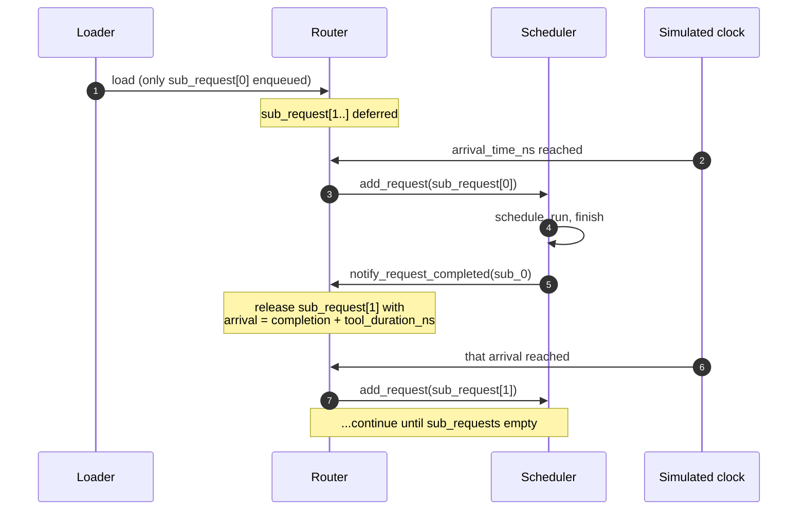

# Agentic sessions

A standard inference benchmark like ShareGPT models *independent*
prompts: each request is one prompt → one response, and the next
request is unrelated to the previous one. Real production traffic
for **agents** doesn't look like this.

A coding agent (Cursor, Aider, or SWE-bench solvers) runs a tight
loop: ask the LLM what to do → run a tool (compile, test, search) →
feed the result back → ask the LLM the next thing → run another tool
→ ... A request budget for "1000 SWE-bench problems" is really 1000
*sessions*, each with 5–50 chained LLM calls and tool waits in
between.

That's what the **agentic** workload format is for.

## The format

Each JSONL line is one session:

```json
{
  "session_id": "session_42",
  "arrival_time_ns": 4059740,
  "sub_requests": [
    {"input_toks": 1472, "output_toks": 133, "tool_duration_ns": 127348767},
    {"input_toks": 1582, "output_toks": 125, "tool_duration_ns": 197295027},
    {"input_toks": 1734, "output_toks": 77,  "tool_duration_ns": 0}
  ]
}
```

Three sub-requests have completion-to-next-request-ready pauses between them.
`tool_duration_ns` is the legacy field name; public traces may label that
pause as `tool`, `human`, `mixed`, or `unknown`. The simulator does not model
the external activity itself, it advances to the resulting ready event.

For cold-KV restore, that ready event is also the earliest legal issue epoch.
A `tool` return becomes restore-eligible when the tool result/request-ready
event occurs, immediately after the modeled tool finishes. A `human` return
cannot be predicted, so restore becomes eligible only when the user
message/request-ready event is observed. A `mixed` return uses the latest
required input event. Strict P/D pair-FIFO or prepare-boundary admission may
delay the physical issue and is reported separately. Restore is not backdated
into an already elapsed human or tool gap.

Full schema reference is on
**[JSONL format → Agentic format](./jsonl-format#agentic-format)**.

## How the simulator handles dependency chains

When the workload is loaded, **only the first sub-request** of each
session is added to `Router._pending_requests`. The rest live in
`Router._deferred_sessions`, keyed by session id.



`Router.has_deferred_sessions()` keeps the main loop from exiting
while sessions are still active (otherwise a workload with a long
final tool_duration could exit prematurely between sub-requests).

When no request, model iteration, or migration is runnable before the next
dependency or first-arrival event, the simulator advances its clock directly
to that event. The interval is real trace-induced idle time. Replaying an
agentic trace therefore does not imply an always-backlogged serving system;
report this trace-faithful panel separately from a saturated-load sweep.

For the full lifecycle, see
**[Simulator → Request lifecycle](/docs/simulator/request-lifecycle#agentic-sessions-when-stage-10-is-not-the-end)**.

## Bundled SWE-bench example

The repo ships
`workloads/swe-bench-qwen3-30b-a3b-50-sps0.2.jsonl`: 50 SWE-bench
sessions for `Qwen3-30B-A3B-Instruct-2507`, arriving at 0.2
sessions/second.

The file contains 765 LLM calls. Sessions have 6-20 calls (p50 17),
input length is 5,058 tokens at p50 and 10,207 at p90, and positive
between-turn tool waits are 112 ms at p50 and 164 ms at p90 (maximum
10.4 s).

Run it with the bundled DP+EP MoE config:

```bash
python -m serving \
  --cluster-config 'configs/cluster/single_node_moe_dp_ep_instance.json' \
  --dtype bfloat16 --block-size 16 \
  --dataset 'workloads/swe-bench-qwen3-30b-a3b-50-sps0.2.jsonl' \
  --output 'outputs/swebench_run.csv' \
  --num-reqs 1
```

`--num-reqs 1` means one *session* (which expands to 6-20
sub-requests in this trace). Bump it for longer runs.

## Building your own agentic workload

The bundled `agent-traces` generator converts TraceLab, LMCache, and
Exgentic/DiscoPosse sources while preserving token-count and prefix-reuse
provenance:

```bash
python -m workloads.generators agent-traces \
  --format tracelab --source path/to/source.jsonl.gz \
  --output workloads/generated/agentic.jsonl \
  --sps 0.2 --seed 42
```

For a remote Hugging Face source, pass immutable
`--source-revision <dataset-commit>` and, when retokenizing,
`--tokenizer-revision <model-commit>`. Both revisions are written to the
conversion manifest; omitting them makes a moving dataset or tokenizer branch
part of the experiment definition.

See the [agentic idle-KV tiering example](/docs/examples/memory-tiers/agentic-idle-kv-tiering#public-traces)
for public dataset choices, converter semantics, and a validated TraceLab
command. For another source, the extraction pattern is:

1. **Extract sessions from your trace source.** For SWE-bench, that's
   one session per problem; for browser-agent traces, one session per
   user task.
2. **For each session, extract the per-call (prompt, response) pairs
   and inter-turn delays.** Measure from the preceding response completion to
   the latest input event required to issue the next request. This preserves
   human pauses and avoids charging tool time that overlapped response streaming.
3. **Tokenize prompts** with the simulator's target model's
   tokenizer. Optionally tokenize responses too if you want
   downstream analysis.
4. **Write one JSONL line per session** with the schema from
   [JSONL format → Agentic](./jsonl-format#agentic-format).

A minimal Python sketch:

```python
import json
from transformers import AutoTokenizer

tok = AutoTokenizer.from_pretrained("Qwen/Qwen3-30B-A3B-Instruct-2507")

with open("workloads/my-agentic.jsonl", "w") as f:
    for session_id, calls in extract_sessions_from_my_data():
        sub_requests = []
        for prompt, response, next_call_delay_ns in calls:
            ids_in = tok.encode(prompt)
            ids_out = tok.encode(response)
            sub_requests.append({
                "input_toks": len(ids_in),
                "output_toks": len(ids_out),
                "input_tok_ids": ids_in,
                "output_tok_ids": ids_out,
                "tool_duration_ns": next_call_delay_ns,
            })
        # last sub-request has no follow-up
        if sub_requests:
            sub_requests[-1]["tool_duration_ns"] = 0

        f.write(json.dumps({
            "session_id": session_id,
            "arrival_time_ns": session_start_ns(session_id),
            "sub_requests": sub_requests,
        }) + "\n")
```

Adjust the `extract_sessions_from_my_data()` and
`session_start_ns()` to your dataset.

## Session load models

The online simulator separates the source trace from the experiment's
session-level load model:

- `trace` preserves every session's first-call `arrival_time_ns`. This is the
  default and is appropriate for a trace-faithful offered-load replay.
- `poisson` replaces only first-call arrivals with one deterministic global
  exponential process. Internal human/tool gaps remain closed-loop and begin
  after the preceding LLM call completes. With a positive
  `--max-active-sessions K`, offered sessions that find all `K` slots occupied
  wait in a FIFO admission backlog. The slot is retained through internal
  gaps and released only at final session completion.
- `backlog` places every session template in a backlog and keeps at most `K`
  sessions active. A session holds its slot through LLM calls and human/tool
  waits, and releases it only when its final request completes on its
  colocated or decode owner. Sessions beyond `K` wait in FIFO order; they are
  not dropped. With P/D disaggregation, prefill completion and the P→D
  ownership handoff retain the slot. An `output_toks=1` final request completes
  after that handoff, without launching a D-side model graph; longer requests
  release the slot after their final D-side token completes.

Run a reproducible Poisson panel at 0.2 sessions/s:

```bash
python -m serving \
  --dataset workloads/generated/agentic.jsonl \
  --session-arrival-mode poisson \
  --session-arrival-rate-sps 0.2 \
  --session-arrival-seed 42 \
  --max-active-sessions 32 \
  --session-metrics outputs/poisson-session-metrics.json \
  --output outputs/poisson-requests.csv
```

Run a closed-backlog panel with maximum active session population `K=32` and
five deterministic passes over the input templates:

```bash
python -m serving \
  --dataset workloads/generated/agentic.jsonl \
  --session-arrival-mode backlog \
  --max-active-sessions 32 \
  --session-backlog-epochs 5 \
  --session-warmup-completions 128 \
  --session-measure-completions 512 \
  --session-metrics outputs/backlog-k32-session-metrics.json \
  --output outputs/backlog-k32-requests.csv
```

### Bounded online experiment runner

`python -m serving.online_experiments --spec <spec.json>` runs every cell
through the online `python -m serving` path, with bounded parallelism and a
600-second default wall limit per cell. Long paper specs may opt in to as much
as 3,600 seconds with `timeout_seconds` or `--timeout-seconds`; the runner
reserves the final two seconds for process-group termination. Paper specs can
add `dataset_contract` to pin the converted JSONL before any simulation starts:

Use the same pinned spec for separate closed-backlog and Poisson executions by
selecting one configured mode per invocation. Omitting `--mode` still runs
every mode in the spec.

```bash
python -m serving.online_experiments --spec <spec.json> --mode backlog
python -m serving.online_experiments --spec <spec.json> --mode poisson
```

The selected mode is recorded in the suite manifest and provenance. Mode
selection changes only which run descriptors are launched; it does not rewrite
the spec, cohort, policies, or load settings. `--mode` may be repeated to select
both configured modes explicitly.

#### Fixed paired measurement cohorts

The legacy `completion_order` selection chooses the first completed sessions
after the completion-count warmup. That is useful for steady-state windows,
but a policy that changes completion order can otherwise be compared with its
oracle on a different set of sessions. For a paired early-stop backlog cell,
select a policy-independent cohort instead:

```json
{
  "modes": {
    "backlog": {
      "k_values": [12],
      "backlog_epochs": 8,
      "warmup_completions": 2,
      "measure_completions": 4,
      "measurement_cohort_selection": "admission_order",
      "stop_after_measurement": true
    }
  }
}
```

For `admission_order`, let `W = warmup_completions` and
`M = measure_completions`. Before execution, the first `W` runtime sessions in
the finite backlog become a fixed, excluded admission-prefix warmup and the
immediately following `M` sessions become the measured target. The required
prefix is therefore the first `W + M` sessions. This is an admission-order
selection rule, not a temporal barrier: target sessions may be admitted or
even complete while a warmup-prefix session remains unfinished. Backlog IDs
have the form
`<source-session-id>::template=<template-index>::epoch=<epoch>`, and ordering
is epoch-major: every selected template in epoch 0, then every template in
epoch 1, and so on. For two templates and two epochs, for example, the order is
`template=0::epoch=0`, `template=1::epoch=0`,
`template=0::epoch=1`, `template=1::epoch=1`. The template index makes runtime
identity explicit even when source labels are reused.

This selection requires `backlog` mode and `W + M` no larger than the
materialized epoch-expanded backlog. The low-level simulator accepts
`M == 0` to mean every session after the fixed warmup prefix; the bounded
online runner resolves `"all"` to an explicit positive count before launch.
Do not put `--session-measurement-cohort-selection` in
`common_serving_args`; it is a runner-managed flag.

The fixed prefix does not reduce the active pressure population to the measured
sessions. The router fills up to `K` initially and replaces every completed
session while any required-prefix session remains incomplete and finite
backlog remains.
Non-target sessions therefore contribute realistic batching, HBM admission,
and tier pressure. With early stop enabled, the cutoff waits until all `W + M`
required-prefix sessions have completed, even if all measured targets finish
first. Admission freezes before the final required completion can refill its
slot. Already dispatched ASTRA work drains; all other live or unadmitted
sessions are then reported as right-censored and their P/D, tier, and transfer
ownership is released. Censoring is an explicit measurement disposition, not
a dropped session.

Every policy and the automatically added infinite-HBM oracle receive the same
ordered warmup, target, and required-prefix IDs. Postprocessing reconstructs
those IDs from the materialized workload, verifies their exact FIFO-prefix
admission indices, checks the ordered SHA-256 digests, and rejects a
baseline/oracle pair whose measured session membership differs. This fixes the
*measured* cohort; background non-target progress before the boundary can still
differ because that is part of each policy's online behavior.

The session report records the ordered warmup, target, and required-prefix ID
lists, counts, completed counts, digests, and human-readable target/bound
semantics under `measurement_window`. Its measurement bounds are the minimum
target admission timestamp and maximum target completion timestamp. Lifecycle
rows expose `planned_admission_index`, `admission_index`,
`measurement_warmup`, `measurement_target`, `measurement_required`, and
`measurement_included`. `summary.csv` and the mode summary copy the selection,
all three prefix definitions, their ordered-ID JSON and digests, the measured
membership digest, and the baseline/oracle cohort-match result. See
[Reading the output](/docs/simulator/reading-output#session-metrics-json) for
the denominator distinction between the fixed session cohort and the strict
completion-time window.

#### Timing-warning contracts

Timing validation still fails on every invariant violation. Warnings are also
fail-closed by default. Prefer a narrow machine-readable allowlist when one
known diagnostic is expected:

```json
{
  "allowed_timing_warning_codes": [
    "request_latency_over_one_hour"
  ]
}
```

The setting may be declared at suite level or overridden per mode. Supported
codes are `zero_inter_token_latency`, `zero_request_latency`,
`request_latency_over_one_hour`, and
`max_request_latency_over_p50_1000x`. Unknown or duplicate configured codes
fail before launch; emitted codes outside the allowlist fail result
validation. The session report keeps `warnings` and `warning_codes` in
one-to-one order, and summaries retain both JSON lists plus the configured
allowlist.

`allow_timing_warnings: true` is the legacy all-or-nothing escape hatch. It is
used only when `allowed_timing_warning_codes` is absent. If an allowlist is
present, the allowlist takes precedence and the legacy boolean cannot broaden
it. An older report with warning text but no warning code cannot pass an
allowlist audit.

To require a measured SSD-resume opportunity for one policy, add an explicit
suite contract:

```json
{
  "ssd_resume_opportunity_contract": {
    "mode": "backlog",
    "policy": "hbm_cpu_ssd",
    "minimum_fraction_of_all_requests": 0.3
  }
}
```

For each swept load, the audited fraction is
`sum(ssd_resume_count) / sum(session_cohort_request_count)`. The denominator is
every completed LLM request in the measured session cohort, including initial
requests, non-reuse calls, and every resume source; it is not just the subset
eligible to resume. When a load has multiple arrival seeds, the runner sums
their integer SSD-resume counts and all-request counts separately before
dividing. Seeds with different request counts are therefore weighted by their
denominators rather than averaged as per-seed fractions. Pooling is independent
at each load value.

The contract passes when at least one load for the named mode and policy meets
the threshold. The runner writes the counts, per-load fractions, maximum
observed fraction, and first reaching load to
`ssd_resume_opportunity_contract.json`. A missing target row, invalid count, or
fraction that does not reconcile with its counts is a validation error; a
well-formed result below the threshold marks the suite `failed_validation`.
The policy and mode references are checked before subprocess launch. If a
partial invocation selects a different mode, the declaration remains in the
suite manifest but its opportunity audit is inactive for that invocation.

Durable capacity baselines accept an explicit result contract in the policy
descriptor:

```json
{
  "policies": {
    "hbm_ssd_direct": {
      "agentic_kv_config": "configs/agentic_kv/direct.json",
      "durable_capacity_contract": "lossless-working-set"
    }
  }
}
```

Both `hbm_ssd_direct` and capacity-only `tiered` always reject cancelled
capacity demotions, TTL drops, and HBM-side capacity drops. The default
`terminal-ssd-lru` contract still permits a genuine full-SSD LRU eviction.
`lossless-working-set` additionally requires every terminal-loss and
avoidable-recompute counter to be present and zero, and rejects any reusable
continuation whose source is `dropped`. Use the latter for a paper cell whose
configured SSD capacity exceeds the selected workload's working set.

#### Synthetic long-context transformation

`target_max_sequence_tokens` is a lineage-aware length sensitivity, not a
naive multiplication of every token field. The materializer chooses one
global rational factor that makes the largest transformed
`input_toks + output_toks` reach the target. It applies integer floor only to
prompt-prefix coordinates; generated `output_toks` remain unchanged.

For an adjacent continuation, a reusable coordinate inside the predecessor's
prompt is scaled by that factor. Any reusable suffix that lies in the
predecessor's generated output is carried over token-for-token, not scaled.
Both `prefix_reuse_toks` and `policy_independent_reuse_toks` are then bounded
by the transformed predecessor context and the current transformed prompt.
The first turn and any `context_shrink`, `round_gap`, compaction, or context
reset are lineage breaks, so both operational reuse fields become zero.

After reuse is mapped, operational `newly_append_toks` is derived as
`input_toks - prefix_reuse_toks`; it is not independently scaled. Source
append provenance remains in `raw_newly_append_toks` and in
`online_length_scaling_original.newly_append_toks`. Each transformed request
records its original operational/observed fields under
`online_length_scaling_original` and its predecessor bound, break decision,
and per-reuse-field mapping under `online_length_scaling_lineage`. The cohort
manifest records the exact numerator/denominator, rounding rule, adjustment
counts, source hashes, and selected-session identity hash. Provider-observed
fields, gaps, ordering, and output counts remain unchanged. Synthetic token-ID
arrays, if present, are removed because no exact token sequence realizes the
new lengths; their original count and SHA-256 remain as provenance.

The Qwen3 1M TraceLab experiments are intentionally split into discovery and
main contracts. The capped-Poisson discovery spec uses the previously
validated two-template human/tool pressure trace, repeats each template 16
times, fixes the active-session cap at 20, and sweeps offered session rate.
It is for finding a load region, not for a headline population result. The
main Poisson spec uses a disjoint pinned eight-template cohort: three
human-return-only and five tool-return-only sessions, 24 requests, and 48
requested output tokens. It applies the same globally recorded context-length
transform and allows up to one hour per cell.

The transform reaches exactly one million sequence tokens but is not an
empirical 1M length distribution. The cohort manifest preserves every original
length, global rational factor, rounding rule, source surrogate index, source
hash, and selected-session identity hash. The long backlog repeats complete
templates, fixes the measured cohort by admission order, and stops only after
that fixed cohort is complete; the remaining population is explicitly
right-censored. The main capped-Poisson panel instead fully drains every
session for each offered rate and seed. Poisson offers remain generated
independently of completions, while the fixed 20-session cap places excess
offers in the FIFO session-admission queue. The experiment therefore sweeps
offered rate, not K. Discovery uses seed 17; the main panel uses the fixed seed
set 101, 211, and 307 for every policy. Paired cells must have the same exact
ordered arrival-schedule hash, not merely the same seed integer.

Both main specs compare four baselines plus a strict infinite-HBM oracle. Both
the quick and main-long backlog specs also request a paired grouped-bar SVG of
baseline throughput
divided by its same-K oracle for K at or above 10. Ratios are computed per
paired run before averaging; a missing or duplicate pair is an experiment
error. The SVG has a same-stem JSON sidecar containing the formula, every pair
key, both absolute throughputs, each ratio, and the paired mean. The
absolute-throughput grouped bar remains available beside it.

The separately checked-in
`online_tracelab_qwen3_1m_p4d4_pressure_pilot.json` is not that full-cohort
paper sweep. It selects one human-return and one tool-return two-turn template,
expands them through eight backlog epochs at `K=12`, and measures the fixed
first four epoch-major admissions. The measured denominator is therefore eight
requests with two human and two tool returns. The initial active population
contains six copies of each template: after the global 1M-token transform,
their block-rounded dormant KV is about 841.2 GB. This is within 1.5% of the
previous four-template pilot's 828.9 GB at `K=12`, while removing its
high-output template reduces decode work to target the hard 600-second
per-cell budget. The pilot censors the remaining pressure population after
the fixed cohort completes. It runs the tiered HBM+CPU+SSD cell and its strict
infinite-HBM oracle to discover whether the all-request SSD-resume opportunity
reaches the declared 30% threshold. Only the one-hour request-latency warning
is allowed. Treat this as a bounded pressure/opportunity pilot, not as a
complete-cohort or steady-state result.

```json
{
  "dataset": "workloads/generated/agentic.jsonl",
  "dataset_contract": {
    "expected_sha256": "<converted-jsonl-sha256>",
    "expected_source_session_count": 4281,
    "expected_schema_version": 3,
    "manifest": "workloads/generated/agentic.jsonl.manifest.json",
    "expected_manifest_sha256": "<manifest-sha256>",
    "expected_selected_template_count": 24,
    "expected_selected_request_count": 82,
    "expected_selected_session_identity_hash": "<selection-sha256>"
  }
}
```

Relative manifest paths resolve from the repository root. The runner checks
the converted file hash, parsed row count, manifest schema/output/source
provenance, and the complete-session selection identity. A mismatch is an
experiment error; omitting `dataset_contract` preserves the previous behavior.

`poisson` and `backlog` accept only agentic rows. Use `trace` for a file that
mixes flat requests and sessions. Backlog epochs are finite so every run has a
deterministic drain condition. For a separate steady-state-oriented study, use
enough epochs to amortize startup and exclude a declared number of completed
sessions as warmup. A positive
`--session-measure-completions` takes the next fixed number of completions, so
the reported throughput does not include the final backlog drain. With the
default zero values, the aggregate includes every completion. Per-request and
per-session records retain `session_epoch` for additional offline checks.

The session metrics JSON reports session admission queueing, session E2E from
offer and from admission, session/request/token throughput, request TTFT and
TPOT, and resume TTFT split by human/tool return and HBM/CPU/SSD residency. It
keeps per-pair FIFO admission, preparation-boundary admission, physical restore,
the complete owner-ready gate, and post-eligibility scheduler queueing as
separate distributions.
The online experiment summary flattens offered-to-completion E2E as
`session_jct_*_ns` and admission-to-completion E2E as
`session_execution_*_ns`. It also records an exact SHA-256 of ordered
`(session_id, offered_time_ns)` pairs and rejects paired policies whose
observed Poisson schedules differ.
It also reports the realized Poisson offered rate and, for backlog runs, mean
and peak active sessions plus the fraction of measured time at configured
`K`.
Resume-source fractions include an explicit all-request denominator, so an
SSD resume rate cannot silently exclude initial requests or no-reuse calls.

If a bounded run enables `--session-stop-after-measurement`, newly offered and
dependent turns freeze at the measurement boundary while already dispatched
ASTRA work drains. The simulator then censors pending rows and releases all
P/D preallocations, tier ownership, claims, locks, and external-fabric jobs; a
non-quiescent cleanup fails the run and is recorded under `censoring`. The
fixed admission-order required prefix—excluded warmup followed by measured
target—remains fully completed and is not part of the censored population.
Before that boundary, closed-backlog slots continue to refill so the measured
sessions run under the configured pressure. The checked-in complete-cohort
paper sweep instead disables early stop and requires every planned session and
request to finish; the separate pressure pilot uses the fixed admission-order
early-stop behavior described above.

Session-metrics schema 9 records this contract as
`queue_policy=fifo_wait_for_slot`, `logical_session_drop_count=0`,
`slot_release_event=final_request_completion_on_decode_owner` for P/D runs
(`final_request_completion_on_colocated_owner` otherwise), and either
`cutoff_disposition=drain` or `right_censor`. The
`slot_release_event_legacy` field retains the old, ambiguous label for file
compatibility only. The bounded runner validates these fields, exact backlog
FIFO-prefix admission indices, active/completed/censored counters, and the
configured `K` bound. A tier report's `event="drop"` removes only a
`kv_cache_entry`; it has `logical_session_effect=none` and does not release a
session slot.

## Picking arrival rates

Agentic workloads are usually **much sparser** than ShareGPT-style
workloads in arrival rate, because each session lasts much longer
in simulator-time:

| Workload | Typical sps | Why |
| --- | --- | --- |
| ShareGPT | 5-20 | Each request finishes in 1-5 seconds; high arrival rate keeps the scheduler busy |
| Agentic SWE-bench | 0.1-0.5 | Each session can run for 30-120 seconds; even 0.2 sps overlaps many sessions |

The bundled SWE-bench file uses `sps=0.2`. With 50 sessions arriving
over 250 simulator-seconds and each running ~60 seconds, you get
~12 sessions active concurrently, a realistic load.

## Mixing flat + agentic in one file

The loader handles per-line auto-detection, so you can have:

```jsonl
{"input_toks": 100, "output_toks": 50, "arrival_time_ns": 0}
{"session_id": "s0", "arrival_time_ns": 1000000, "sub_requests": [{"input_toks": 200, "output_toks": 100, "tool_duration_ns": 0}]}
{"input_toks": 150, "output_toks": 80, "arrival_time_ns": 2000000}
```

Useful when you want a sanity-baseline of independent prompts mixed
with agentic sessions.

## Gotchas

1. **Last sub-request's `tool_duration_ns` should be 0** (or just
   omitted in a source schema that treats 0 as default). The simulator
   ignores it because no dependent turn remains, but 0 avoids implying
   an unmodeled post-session tool event in trace analysis.
2. **Session arrival_time_ns is for the *first* sub-request.**
   Subsequent sub-requests have their arrival times computed at run
   time as `previous_completion + tool_duration_ns`.
3. **A pause label belongs to the following return.** On sub-request *N*,
   `tool_duration_ns`, `inter_turn_gap_type`, and `tool_wait_source` describe
   the outgoing *N*→*N+1* interval. Runtime and capacity replay copy them to
   sub-request *N+1* as `return_gap_ns`, `return_gap_type`, and
   `return_gap_source`. The first call is `session_start`; human, tool, mixed,
   and unknown returns remain separate.
4. **Preserve raw append provenance.** TraceLab conversion writes
   `raw_newly_append_toks` before its legacy scheduling-compatible normalization
   and may legitimately preserve zero. `newly_append_toks` may be normalized to
   at least one; it must not define how much prefill can overlap restore.
   Runtime uses `input_toks - agentic_kv_hit_tokens`, and capacity replay uses
   `input_toks - effective_reuse_toks`, then keeps the final prompt token behind
   the restore join. A one-fresh-token continuation therefore hides none of the
   restore latency.
5. **Provide prefix-reuse evidence.** Prefer causal completed-context token IDs.
   For sanitized TraceLab, keep provider-observed prefix tokens separate from
   the policy-independent adjacent-round eligibility estimate. Never use an
   incumbent cache miss to declare that a different retention policy had no
   reusable KV. Estimated and exact provenance must remain separate in results.
6. **Every agentic session is sticky across serving roles.** In colocated
   serving, dependent turns return to the same instance. In P/D mode, the
   router maintains separate sticky prefill and decode affinities: a
   continuation returns to its prefill owner and then to its decode owner.
   In the validated same-node P/D baseline, this is identical for `off`,
   generic prefix-cache-only, recompute, CPU-swap, and tiered runs, so the
   comparison does not conflate cache policy with a different placement
   decision. Do not generalize that guarantee to an unvalidated multi-node
   routing pool.

## What's next

- **[Simulator → Request lifecycle](/docs/simulator/request-lifecycle)**
  what happens at runtime when the simulator processes a session.
- **[Examples → DP+EP MoE](/docs/examples/parallelism/dp-ep-moe)** -
  uses the bundled SWE-bench agentic workload.
- **[Examples → Agentic idle KV tiering](/docs/examples/memory-tiers/agentic-idle-kv-tiering)** -
  compares HBM retention, recomputation, CPU swap, and CPU/SSD tiering.
